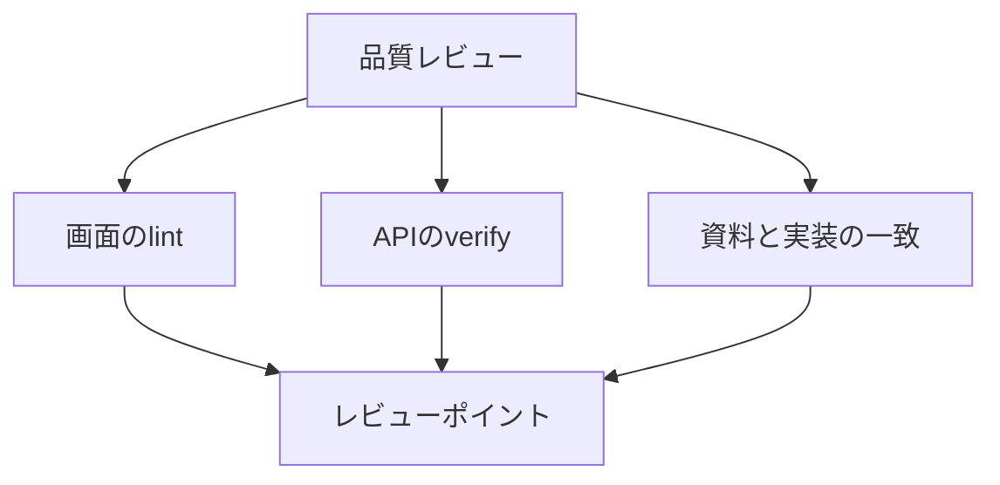

# 品質レビュー

レビューは、画面の静的チェック、API の静的チェック、資料と実装の一致の三つを見る。指摘は、下のレビューポイントに沿って書く。

## 手順

1. `frontend` で `npm run lint` を走らせる。失敗したら直してから先へ進む。
2. `backend` で `mvnw verify` を走らせる。テスト、javac の `-Xlint`、SpotBugs がまとめて走る。
3. 次の資料を、実装と突き合わせる。食い違いは実装を正にして資料を直す。
   - `ドキュメント/要件定義書.md`
   - `ドキュメント/機能要件.md`
   - `ドキュメント/機能要件定義書.md`
   - `ドキュメント/画面設計書.md`
   - `ドキュメント/画面見取り図.md`

## レビューポイント

### 画面

- `npm run lint` が通る。
- Hooks に沿う。描画中に ref を書かない。
- クリックで開くカードは、キーボードでも開けるか見る。

### API

- `mvnw verify` が通る。
- SQL はプレースホルダを使う。
- 複数の文で更新する処理はトランザクションに入れる。
- 業務の手順を Repository に寄せすぎない。
- 並びの SQL は、Web 層のモックだけでは見ない。

### 資料

要件定義書、機能要件、機能要件定義書、画面設計書、画面見取り図が実装と一致している。食い違ったときは、実装を正にして資料を直す。
