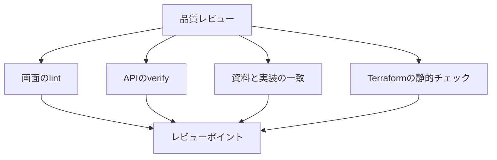

# 品質レビュー

レビューは、画面の静的チェック、API の静的チェック、資料と実装の一致、Terraform の静的チェックの四つを見る。指摘は、下のレビューポイントに沿って書く。

```mermaid
flowchart TD
  review[品質レビュー] --> ui[画面のlint]
  review --> api[APIのverify]
  review --> spec[資料と実装の一致]
  review --> tf[Terraformの静的チェック]
  ui --> points[レビューポイント]
  api --> points
  spec --> points
  tf --> points
```

## 手順

1. `frontend` で `npm run lint` を走らせる。失敗したら直してから先へ進む。
2. `backend` で `mvnw verify` を走らせる。テスト、javac の `-Xlint`、SpotBugs がまとめて走る。
3. 次の資料を、実装と突き合わせる。食い違いは実装を正にして資料を直す。
   - `ドキュメント/要件定義書.md`
   - `ドキュメント/機能要件.md`
   - `ドキュメント/機能要件定義書.md`
   - `ドキュメント/画面設計書.md`
   - `ドキュメント/画面見取り図.md`
4. `infra` に `.tf` があるとき、そのディレクトリで次を走らせる。失敗したら直してから先へ進む。
   - `terraform fmt -check`
   - `terraform init -backend=false` のあと `terraform validate`
5. `infra` の `.tf` と、リポジトリ直下の `.gitignore` を、下の Terraform のレビューポイントと突き合わせる。`terraform.tfvars` の中身は、パスワードを表示せずに接続元だけを見る。

## レビューポイント

### 画面

- `npm run lint` が通る。
- Hooks に沿う。描画中に ref を書かない。
- クリックで開くカードは、キーボードでも開けるか見る。

### API

- `mvnw verify` が通る。
- SQL はプレースホルダを使う。
- 複数の文で更新する処理はトランザクションに入れる。
- 業務の手順を Repository に寄せすぎない。
- 並びの SQL は、Web 層のモックだけでは見ない。

### 資料

要件定義書、機能要件、機能要件定義書、画面設計書、画面見取り図が実装と一致している。食い違ったときは、実装を正にして資料を直す。

### Terraform

`infra` が無い変更では、この節は見ない。

- `terraform fmt -check` が通る。
- `terraform validate` が通る。
- ingress に `0.0.0.0/0` を書かない。egress の `0.0.0.0/0` は、外へ出る理由がコメントにあるものだけ残す。
- RDS は `publicly_accessible = false` にする。5432 の許可元は EC2 のセキュリティグループだけで、CIDR は書かない。
- パスワードと接続元アドレスは variable にする。値は `terraform.tfvars` に置き、`.tf` に直書きしない。`db_password` は `sensitive` にする。
- `.gitignore` に `.terraform/`、`*.tfstate`、`*.tfstate.*`、`*.tfvars`、`infra/keys/` がある。これらはコミットしない。
- EC2 セキュリティグループの `description` を変えると、グループの作り直しになる。インスタンスが付いているあいだは変えない。ポートと説明が違っていても、指摘として残し、その場では直さない。
