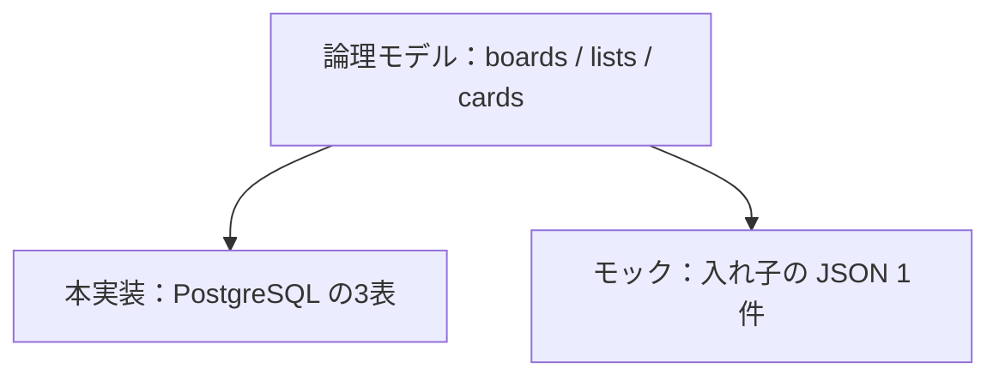
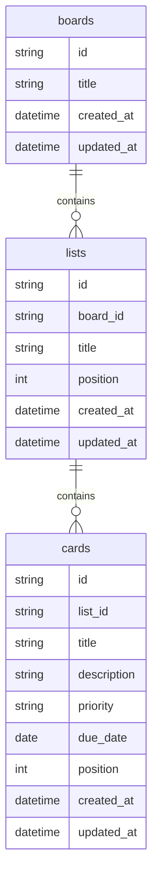
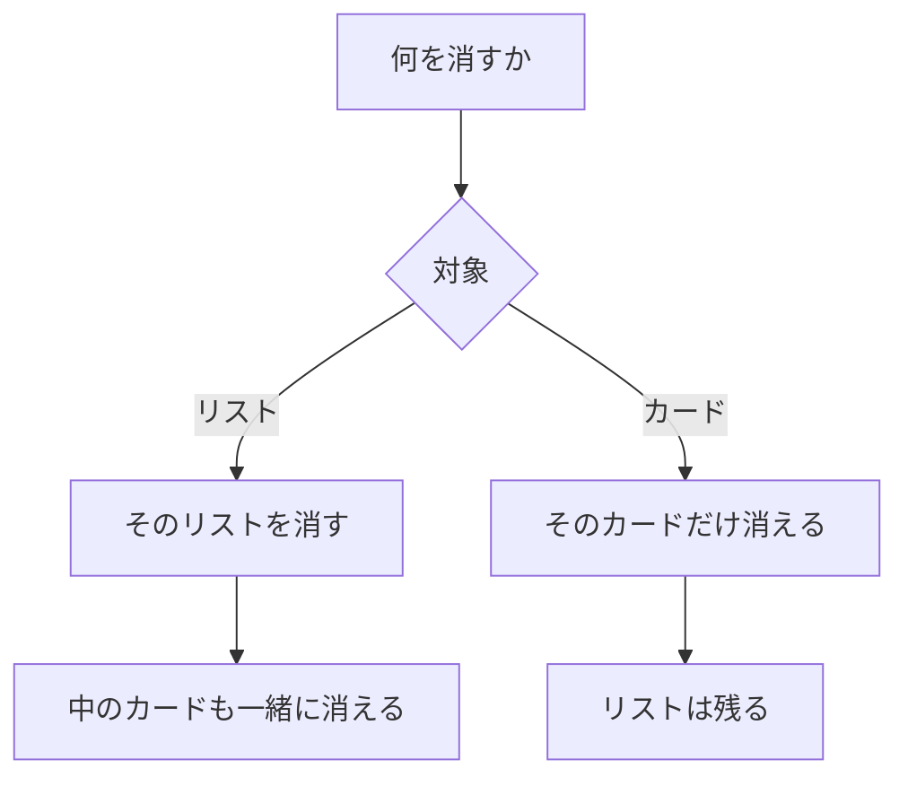

# ER図

| 項目 | 内容 |
|---|---|
| 文書名 | ER図 |
| 対象システム | 課題管理ボード（Trello風タスク管理アプリ） |
| 版 | 1.2 |
| 作成日 | 2026年9月20日 |
| 改訂日 | 2026年9月26日 |
| 作成者 | nsb |
| 関連資料 | 用語定義書、要件定義書、データベース設計、機能要件 |
| 目的 | ボード・リスト・カードの関係を図で示す |

この資料は論理データモデルの図です。表の項目・型・制約の正は「データベース設計」とします。  
本実装の保存は PostgreSQL の3表です。フォルダ直下のモックは、まだ localStorage の JSON 1件です。

---

## 1. この図の位置づけ

| 種類 | 内容 |
|---|---|
| モックの保存 | JSON 1件。ボードの中にリストの配列、リストの中にカードの配列 |
| この ER 図 | ドメインと、PostgreSQL の3表に対応する論理モデル |
| 本実装 | PostgreSQL。boards / lists / cards |

---

## 2. 論理 ER 図

---

## 3. エンティティ

| エンティティ | 意味 | 画面上の呼び方 |
|---|---|---|
| boards | 作業全体の台。今回は常に1件 | ボード |
| lists | カードを入れる縦の列 | リスト（列） |
| cards | 1つのやること | カード |

---

## 4. リレーション（多重度）

| 関係 | 多重度 | 説明 |
|---|---|---|
| boards と lists | 1 対 0以上 | ボード1枚にリストは複数。リストは必ず1つのボードに属する |
| lists と cards | 1 対 0以上 | リスト1つにカードは複数。カードは必ず1つのリストに属する |
| カードの移動 | 所属の付け替え | カードをつまんで置くと、所属リストと並び順が変わる。カード自体は増えない |

今回の機能範囲ではボードは1件だけなので、lists.board_id は論理項目である。いまの JSON にはボード id も board_id も無い。

---

## 5. 属性の対応

| 論理項目 | いまの JSON | 備考 |
|---|---|---|
| boards.id | なし | ボードは JSON のルート1件だけ |
| boards.title | `title` | 空なら「課題管理」 |
| boards.created_at / updated_at | なし | 論理項目。いまは持たない |
| lists.id | `lists[].id` | UUID |
| lists.board_id | なし | 入れ子のため不要 |
| lists.title | `lists[].title` | |
| lists.position | 配列の順番 | 専用フィールドは無い |
| cards.id | `lists[].cards[].id` | UUID |
| cards.list_id | なし | 親の配列に入っていることで表す |
| cards.title | `title` | |
| cards.description | `description` | |
| cards.priority | `priority` | high / medium / low |
| cards.due_date | `dueDate` | 論理名は due_date、JSON 名は dueDate |
| cards.position | 配列の順番 | 専用フィールドは無い |
| created_at / updated_at | なし | 論理項目。いまは持たない |

---

## 6. 削除時の関係

リストを消すと、そのリストに属するカードも消える（機能要件 L-4）。  
カードを消しても、リストとボードは残る（機能要件 C-3）。

---

## 7. 改訂履歴

| 版 | 日付 | 内容 |
|---|---|---|
| 1.0 | 2026年9月20日 | 初版。要件定義書 2.0 の論理 ER を独立資料にした |
| 1.1 | 2026年9月21日 | 本実装を PostgreSQL の3表とした。SQLite 将来案は取り下げ |
| 1.2 | 2026年9月26日 | カード移動は所属リストと並び順の付け替えと書いた |
