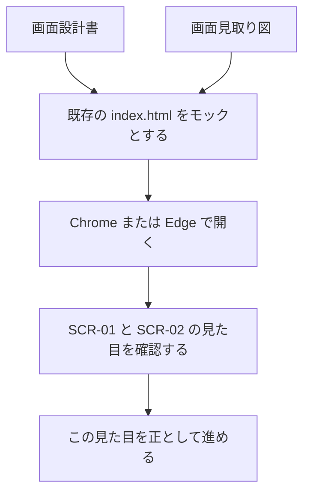

# HTMLモックアップ作成計画

| 項目 | 内容 |
|---|---|
| 文書名 | HTMLモックアップ作成計画 |
| 対象システム | 課題管理ボード（Trello風タスク管理アプリ） |
| 版 | 1.0 |
| 作成日 | 2026年9月20日 |
| 作成者 | nsb |
| 関連資料 | 用語定義書、画面設計書、画面見取り図、技術スタック、操作手順書 |
| 目的 | 画面のイメージを先に認識合わせするため、HTML モックの作り方と正とするファイルを決める |

言葉の意味は「用語定義書」に従います。部品の配置と動きの正は「画面設計書」です。見た目の補助は「画面見取り図」です。使う技術は「技術スタック」です。開き方は「操作手順書」です。

この資料は、実装の前に画面を揃えるための計画です。完成後の使い方そのものは「操作手順書」を正とします。

---

## 1. 方針

新しいモック用フォルダや別 HTML は作らない。すでに動いている次の3ファイルを、認識合わせ用の HTML モック（プロトタイプ）とする。

| ファイル | 役割 |
|---|---|
| `index.html` | 画面の骨格。ボード画面とカード編集の dialog |
| `styles.css` | 色と配置 |
| `app.js` | 操作・描画・保存 |

技術は HTML、CSS、JavaScript だけとする。ライブラリは使わない。開き方は Chrome または Edge で `index.html` を直接開く。



---

## 2. 対象画面

画面設計書の画面一覧に従う。モックで見せる画面は次の2つだけである。

| 画面ID | 画面名 | モックでの扱い |
|---|---|---|
| SCR-01 | ボード画面 | 起動後に常に表示する |
| SCR-02 | カード編集画面 | カードをクリックしたときだけ重ねて開く |

起動直後の並びは画面設計書 2.6 のとおりとする。ボード名は「課題管理」。リストは「未着手」「作業中」「完了」。未着手に説明用カードが1枚あり、作業中と完了は空である。

```mermaid
flowchart TD
  open[index.html を開く] --> scr01[SCR-01 ボード画面]
  scr01 --> click[カードをクリック]
  click --> scr02[SCR-02 カード編集画面]
  scr02 --> close[保存・キャンセル・外側クリック・削除]
  close --> scr01
```

---

## 3. 整える範囲

機能（追加・移動・編集・localStorage）はそのまま残す。画面設計書と食い違っている見た目だけ直す。

| 項目 | 内容 |
|---|---|
| 期限の表示 | カード上は「期限 年月日」とする。例：`期限 2026年9月20日`。組み立ては `app.js` の `formatDueDate` |
| 色と配置 | 画面設計書「色と見た目の約束」に合わせる。ずれがあれば `styles.css` を最小限で直す |
| 確認する画面 | SCR-01 と SCR-02。空リスト表示、優先度の色、期限切れの赤字、編集画面の重ね表示 |

---

## 4. 触らないもの

| 対象 | 理由 |
|---|---|
| 新しい HTML や `mock/` フォルダ | 既存の3ファイルをモックの正とするため |
| 保存の仕組み | 認識合わせの対象は見た目であり、保存方式は変えない |
| 初期データの並び | 画面設計書 2.6 を変えない |
| 部品の動作 | 動きの正は画面設計書のまま |

---

## 5. 確認結果

2026年9月20日に、既存画面を認識合わせ用モックとして確認した。

- ボード画面とカード編集画面の配置・色は画面設計書と揃っている
- 期限の表示を「期限 年月日」に直した
- この見た目を正として、以後の作業を進める

開き方は、フォルダ `アプリケーション` の `index.html` を Chrome または Edge で開く。ログインは不要である。

---

## 6. 改訂履歴

| 版 | 日付 | 内容 |
|---|---|---|
| 1.0 | 2026年9月20日 | 初版。既存の HTML を認識合わせ用モックとする計画を文書化した |
