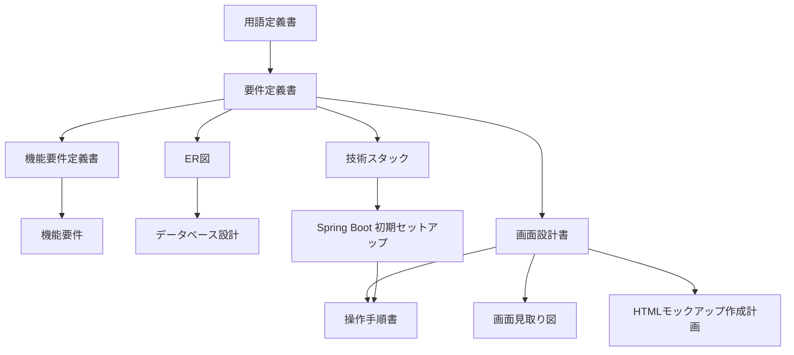

# ドキュメント一覧

課題管理ボード（Trello風の一人用タスク管理）の資料です。プログラムより先に、言葉・範囲・データ・画面・技術をこのフォルダで決めています。

対象は nsb 一人が手元のパソコンで使うボードです。ログインはありません。画面は React、API は Spring Boot、保存は PostgreSQL です。採用した版の正は [技術スタック.md](./技術スタック.md) の「採用した版」です。

| 層 | 場所 | いま動くこと |
|---|---|---|
| 認識合わせ用モック | フォルダ直下の `index.html` | ブラウザの localStorage に保存する |
| 画面 | `frontend/` | Vite で起動し、`GET /api/board` の結果を表示する |
| API | `backend/` | `GET /api/health` と `GET /api/board` |
| 保存 | Docker Compose の PostgreSQL 16 | ボード・リスト・カードの表 |

---

## 1. どの順で読むか

初めて読むときは上から順に見ます。目的が決まっているときは、次の節のグループから入ってください。

| 順番 | 資料 | 役割 |
|---|---|---|
| 1 | [用語定義書.md](./用語定義書.md) | ボード、リスト、カードなどの呼び方を揃える辞書 |
| 2 | [要件定義書.md](./要件定義書.md) | 何を作るか、何を作らないか。背景、利用者、例外、非機能、技術選定の全体 |
| 3 | [機能要件定義書.md](./機能要件定義書.md) | 機能の範囲、操作の流れ、完成とみなす条件 |
| 4 | [機能要件.md](./機能要件.md) | できることを B / L / C / S の番号で引く一覧 |
| 5 | [ER図.md](./ER図.md) | ボード・リスト・カードの関係図 |
| 6 | [データベース設計.md](./データベース設計.md) | 表の項目、型、制約。モックの JSON との対応 |
| 7 | [技術スタック.md](./技術スタック.md) | 採用する技術、採用しない技術、固定した版 |
| 8 | [画面設計書.md](./画面設計書.md) | 画面の配置、部品の役割、画面遷移 |
| 9 | [画面見取り図.md](./画面見取り図.md) | 画面設計書を読む前に、見た目のイメージをつかむ補助 |
| 10 | [HTMLモックアップ作成計画.md](./HTMLモックアップ作成計画.md) | フォルダ直下の HTML を認識合わせ用モックとする約束 |
| 11 | [Spring Bootバックエンド初期セットアップ.md](./Spring%20Bootバックエンド初期セットアップ.md) | JDK、Docker、`backend/` の起動と `GET /api/health` の確認 |
| 12 | [操作手順書.md](./操作手順書.md) | モックの開き方、API の起動、基本の使い方 |

---

## 2. 目的から資料を選ぶ

### 言葉と範囲

用語定義書で呼び方を固定し、要件定義書で全体の約束を決めます。機能の流れと完成条件は機能要件定義書、番号で引く一覧は機能要件です。要件定義書と機能の2資料が、バックエンドとフロントエンドの両方に共通する「何を作るか」の正です。

### データ

関係は ER図、項目と制約はデータベース設計です。本実装の保存は PostgreSQL の3表です。フォルダ直下のモックだけが localStorage の JSON です。

### 技術と起動

使うものと使わないものは技術スタックです。React、Vite、Node.js、Java、Spring Boot、Maven、PostgreSQL の版もここに書いてあります。API を手元で起動する手順の正は Spring Boot バックエンド初期セットアップです。

### 画面

配置とボタンの役割は画面設計書です。先に形をつかむときは画面見取り図を見ます。HTMLモックアップ作成計画は、既存の `index.html` を認識合わせに使う約束です。`frontend/` の React 画面は、その設計のうちボードの読み取り表示まで進んでいます。

### 使い方

完成したアプリの操作と、いま開けるモック・API の開き方は操作手順書です。

---

## 3. 資料の関係

図は GitHub 向けの Mermaid です。コードブロックの言語名を mermaid にし、流れは `flowchart`、データの関係は `erDiagram` で書いています。GitHub で Markdown を開くと図として見られます。

---

## 4. 資料を分けた経緯

| 日付 | 内容 |
|---|---|
| 2026年9月18日 | 用語、要件、画面、操作の初版 |
| 2026年9月20日 | 機能・データ・技術を独立資料にし、HTMLモックアップ作成計画を追加。要件定義書本体は残した |
| 2026年9月21日 | 画面を React（Vite）、保存を PostgreSQL にする選定へ更新。Next.js は対象外 |
| 2026年9月22日 | API を Spring Boot（Java 21）へ切り替え、初期セットアップを追加 |
| 2026年9月23日 | PostgreSQL を Docker Compose で起動し、Spring Boot から JDBC で接続する手順を追加 |
| 2026年9月25日 | 実装で固定した版を技術スタックへ追記し、この一覧を入口として整理 |
