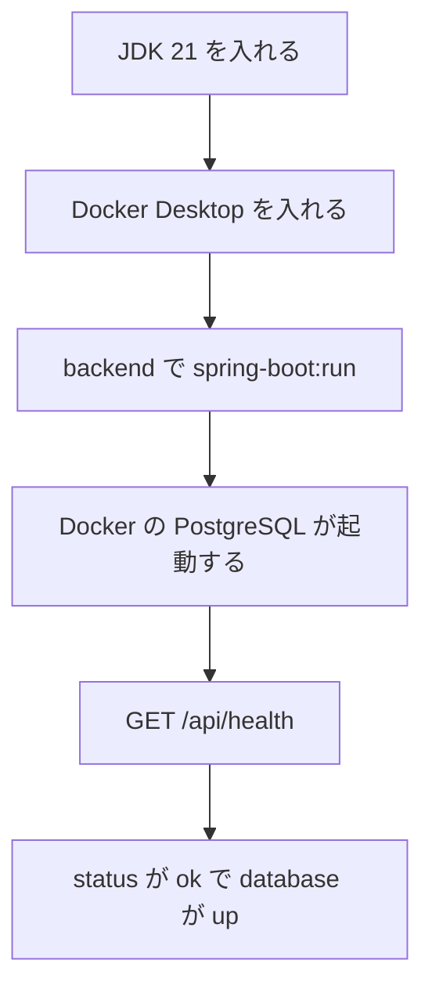

# Spring Boot バックエンド初期セットアップ

| 項目 | 内容 |
|---|---|
| 文書名 | Spring Boot バックエンド初期セットアップ |
| 対象システム | 課題管理ボード（Trello風タスク管理アプリ） |
| 版 | 1.3 |
| 作成日 | 2026年9月22日 |
| 改訂日 | 2026年9月23日 |
| 作成者 | nsb |
| 関連資料 | 用語定義書、要件定義書、技術スタック、データベース設計、操作手順書 |
| 目的 | `backend/` の Spring Boot を、手元の PostgreSQL とつないで動かすまでの手順を決める |

言葉の意味は「用語定義書」に従います。使う技術の正は「技術スタック」です。完成後のアプリの使い方は「操作手順書」です。表の形は「データベース設計」です。

この資料は、API サーバの起動と、Docker 上の PostgreSQL への接続までの手順です。ボード・リスト・カードの API は、まだ対象外です。

---

## 1. 方針

新しいサーバ用フォルダは `backend/` とする。画面のモック（`index.html`）とは別に置く。PostgreSQL は PC に直接入れず、Docker Compose で起動する。

いまの到達点は、サーバが起動し、起動確認用の URL が JSON を返し、そのときに PostgreSQL へ SQL を出せることである。

| 項目 | 内容 |
|---|---|
| 場所 | `backend/` |
| サーバ | Spring Boot 4.1.1 |
| 言語 | Java 21 |
| ビルド | Maven Wrapper（`mvnw.cmd`） |
| ポート | API は 8080。PostgreSQL は 5432 |
| 確認用 | `GET /api/health` → `{"status":"ok","database":"up"}` |



---

## 2. 用意するもの

| 項目 | 内容 |
|---|---|
| OS | Windows |
| JDK | Microsoft Build of OpenJDK 21 |
| インストール例 | `C:\Program Files\Microsoft\jdk-21.0.12.101-hotspot` |
| Maven | 入れなくてよい。`backend/mvnw.cmd` を使う |
| Docker | Docker Desktop。PostgreSQL をコンテナで動かす |
| PostgreSQL | 個別インストールは不要。`docker-compose.yml` で起動する |
| Node.js | この段階では不要 |

JDK が入っているかは、PowerShell で次を実行して確認する。

```powershell
java -version
```

`openjdk version "21..."` と出ればよい。コマンドが見つからないときは、第3章の入れ方を行う。開き直したあとも見つからないときは、第6章の `JAVA_HOME` を使う。

Docker が入っているかは、PowerShell で次を実行して確認する。

```powershell
docker version
docker compose version
```

エンジンのバージョンが出ればよい。コマンドが見つからないときは、第4章の入れ方を行う。入れたあとは Docker Desktop を起動し、エンジンが Running になってから API を起動する。

---

## 3. JDK 21 の入れ方

入っていないときは、PowerShell で次を実行する。

```powershell
winget install --id Microsoft.OpenJDK.21 -e --source winget --accept-source-agreements --accept-package-agreements
```

入れたあとは、Cursor または PowerShell を開き直してから `java -version` を確認する。管理者の許可を求められたら許可する。

---

## 4. Docker Desktop の入れ方

入っていないときは、PowerShell で次を実行する。

```powershell
winget install --id Docker.DockerDesktop -e --source winget --accept-source-agreements --accept-package-agreements
```

入れたあとは、次を行う。

1. PC を一度再起動する（求められた場合）
2. Docker Desktop を起動する
3. 初回は利用規約に同意する
4. エンジンが Running になるまで待つ
5. PowerShell を開き直して `docker version` を確認する

Docker Desktop は WSL 2 を使う。次が入っていないときは、管理者の PowerShell で有効にしてから PC を再起動する。

```powershell
dism.exe /online /enable-feature /featurename:VirtualMachinePlatform /all /norestart
dism.exe /online /enable-feature /featurename:Microsoft-Windows-Subsystem-Linux /all /norestart
wsl --install --no-distribution
```

再起動のあと、もう一度 Docker Desktop を起動する。`docker` コマンドが見つからないときは、PowerShell を開き直す。それでも無いときは、次のフォルダが PATH にあるか確認する。

```text
%LOCALAPPDATA%\Programs\DockerDesktop\resources\bin
```

---

## 5. フォルダ構成

主なファイルは次のとおりである。

| 場所 | 役割 |
|---|---|
| `docker-compose.yml` | PostgreSQL 16 のコンテナ定義 |
| `backend/pom.xml` | 依存関係。Spring Boot 4.1.1、Java 21、JDBC、PostgreSQL、Docker Compose |
| `backend/mvnw.cmd` | Windows 用の Maven Wrapper |
| `backend/.mvn/jvm.config` | Maven が Windows の証明書ストアを使う設定 |
| `backend/src/main/java/com/nsb/taskboard/TaskBoardApplication.java` | 起動の入口 |
| `backend/src/main/java/com/nsb/taskboard/health/HealthController.java` | `GET /api/health`。PostgreSQL に `SELECT 1` を出す |
| `backend/src/main/resources/application.properties` | ポート 8080 と PostgreSQL 接続 |
| `backend/src/main/resources/schema.sql` | boards / lists / cards の表 |
| `backend/src/main/resources/data.sql` | 初期ボード |
| `backend/src/test/java/com/nsb/taskboard/health/HealthControllerTest.java` | 起動確認用のテスト |

パッケージは `com.nsb.taskboard` である。

`application.properties` の決め事は次のとおりである。ファイル本体にも、同じ「用語」と「意味」を書いてある。パスワードは手元専用の初期値であり、提出用の秘密情報ではない。変えるときは環境変数で上書きする。

| No. | 用語 | 設定キー | 初期値 | 意味 |
|---|---|---|---|---|
| 1 | アプリ名 | `spring.application.name` | `task-board` | この API サーバの名前。ログに出る。画面には出ない |
| 2 | APIポート | `server.port` | `8080` | 画面や curl がつなぐ待ち受け番号 |
| 3 | 接続URL | `spring.datasource.url` | `localhost:5432` / `task_board` | PostgreSQL の住所。ホスト・ポート・データベース名 |
| 4 | ユーザ | `spring.datasource.username` | `task_board` | PostgreSQL に入るときの名前 |
| 5 | パスワード | `spring.datasource.password` | `task_board` | PostgreSQL に入るときの合言葉 |
| 6 | JDBCドライバ | `spring.datasource.driver-class-name` | `org.postgresql.Driver` | PostgreSQL へ SQL を出すドライバ |
| 7 | プール名 | `spring.datasource.hikari.pool-name` | `task-board-db` | 接続の束の名前。ログに出る |
| 8 | 最大接続数 | `spring.datasource.hikari.maximum-pool-size` | `5` | 同時に開ける PostgreSQL 接続の上限 |
| 9 | 最小接続数 | `spring.datasource.hikari.minimum-idle` | `1` | 使っていなくても残しておく接続の数 |
| 10 | 接続待ち時間 | `spring.datasource.hikari.connection-timeout` | `30000` | 接続が空くのを待つ上限（ミリ秒） |
| 11 | SQL初期化 | `spring.sql.init.mode` | `always` | 起動のたびに schema.sql と data.sql を実行する |
| 12 | 表定義ファイル | `spring.sql.init.schema-locations` | `classpath:schema.sql` | boards / lists / cards を作る SQL |
| 13 | 初期データファイル | `spring.sql.init.data-locations` | `classpath:data.sql` | 最初のボードを入れる SQL |
| 14 | SQLの文字コード | `spring.sql.init.encoding` | `UTF-8` | 日本語を壊さない読み方 |
| 15 | Composeファイル | `spring.docker.compose.file` | `../docker-compose.yml` | PostgreSQL コンテナの定義 |
| 16 | コンテナの止め方 | `spring.docker.compose.lifecycle-management` | `start-only` | API を止めても PostgreSQL は残す |
| 17 | テスト時のDocker | `spring.docker.compose.skip.in-tests` | `true` | テストではコンテナを起動しない |

接続URL・ユーザ・パスワードは、環境変数 `DB_HOST` / `DB_PORT` / `DB_NAME` / `DB_USER` / `DB_PASSWORD` が無いときの初期値である。

`spring-boot:run` すると、Spring Boot が先に `docker-compose.yml` の PostgreSQL を起動する。API を止めても、コンテナは残る。止めるときは第8章を使う。テストは Docker を起動しない。

---

## 6. 起動する

1. Docker Desktop が Running であることを確認する
2. `backend` フォルダを開く
3. PowerShell で次を実行する

```powershell
cd backend
$env:JAVA_HOME = "C:\Program Files\Microsoft\jdk-21.0.12.101-hotspot"
$env:Path = "$env:JAVA_HOME\bin;$env:Path"
.\mvnw.cmd spring-boot:run
```

`java` がすでに通る場合は、`JAVA_HOME` の2行は不要である。

初回は Maven がライブラリをダウンロードし、Docker が PostgreSQL のイメージを取るため、時間がかかることがある。`Tomcat started on port 8080` と出れば起動できている。

止めるときは、起動した PowerShell で `Ctrl+C` を押す。PostgreSQL のコンテナは残る。

PostgreSQL だけ先に起動したいときは、フォルダ直下で次を実行する。

```powershell
docker compose up -d
```

---

## 7. 動作確認

サーバが起動した状態で、ブラウザまたは別の PowerShell から次を開く。

```text
http://localhost:8080/api/health
```

PowerShell からの例は次のとおりである。

```powershell
curl.exe -s http://localhost:8080/api/health
```

`{"status":"ok","database":"up"}` と出れば、API から PostgreSQL へつながっている。

---

## 8. PostgreSQL を止める

コンテナを止めるときは、フォルダ直下で次を実行する。

```powershell
docker compose stop
```

データも消してやり直すときは、次を実行する。

```powershell
docker compose down -v
```

---

## 9. テスト

起動せずに確認するときは、`backend` で次を実行する。

```powershell
cd backend
$env:JAVA_HOME = "C:\Program Files\Microsoft\jdk-21.0.12.101-hotspot"
$env:Path = "$env:JAVA_HOME\bin;$env:Path"
.\mvnw.cmd test
```

`BUILD SUCCESS` と、health のテストが通ればよい。このテストは PostgreSQL を起動しない。接続の確認は第7章の `GET /api/health` で行う。

---

## 10. いま含めていないもの

次はこの資料の範囲外である。必要になったら「技術スタック」と「データベース設計」に従って足す。

- ボード・リスト・カードの API
- React 画面からの呼び出し
- 認証

---

## 11. うまくいかないとき

| 困ったこと | 確認すること |
|---|---|
| `java` が見つからない | JDK 21 が入っているか確認する。必要なら第6章の `JAVA_HOME` を使う |
| `docker` が見つからない | Docker Desktop が入っているか確認する。入れたら起動し、PowerShell を開き直す |
| Docker エンジンが動かない | Virtual Machine Platform と WSL 2 が入っているか確認する。入れたら PC を再起動する |
| Maven が証明書エラーになる | `backend/.mvn/jvm.config` があるか確認する |
| `/api/health` が開かない | `.\mvnw.cmd spring-boot:run` が動いているか確認する。ポート 8080 が空いているか確認する |
| 起動時に PostgreSQL へつながらない | Docker Desktop が Running か確認する。ポート 5432 が空いているか確認する |
| `4.1.1.RELEASE` が見つからない | `pom.xml` の親バージョンは `4.1.1` である。`.RELEASE` は付けない |

---

## 12. 改訂履歴

| 版 | 日付 | 内容 |
|---|---|---|
| 1.0 | 2026年9月22日 | 初版。JDK の導入から `GET /api/health` までの手順を書いた |
| 1.1 | 2026年9月23日 | Docker Compose の PostgreSQL と JDBC 接続を足した |
| 1.2 | 2026年9月23日 | application.properties の決め事を用語と意味に分けた |
| 1.3 | 2026年9月23日 | JDBCドライバ・接続プール・SQLファイルの項目を足した |
