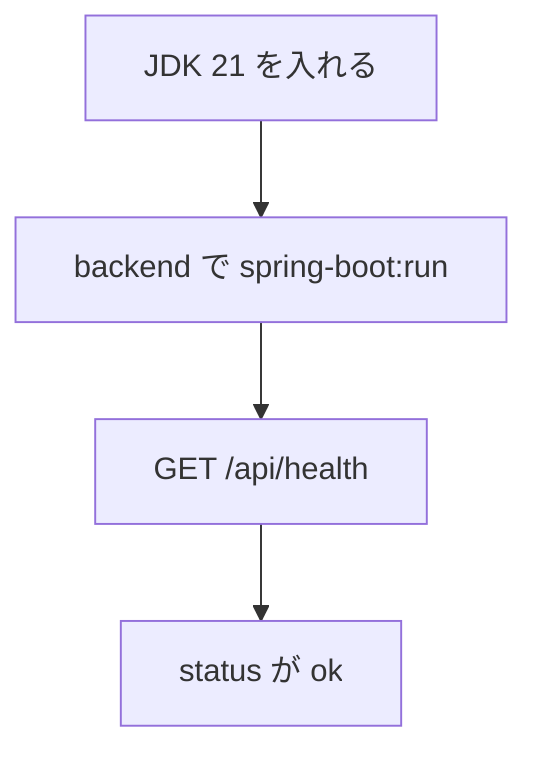

# Spring Boot バックエンド初期セットアップ

| 項目 | 内容 |
|---|---|
| 文書名 | Spring Boot バックエンド初期セットアップ |
| 対象システム | 課題管理ボード（Trello風タスク管理アプリ） |
| 版 | 1.0 |
| 作成日 | 2026年9月22日 |
| 作成者 | nsb |
| 関連資料 | 用語定義書、要件定義書、技術スタック、操作手順書 |
| 目的 | `backend/` の Spring Boot ひな形を、手元で動かすまでの手順を決める |

言葉の意味は「用語定義書」に従います。使う技術の正は「技術スタック」です。完成後のアプリの使い方は「操作手順書」です。

この資料は、API の最初の環境を揃える手順です。ボード・リスト・カードの API や PostgreSQL 接続は、まだ対象外です。

---

## 1. 方針

新しいサーバ用フォルダは `backend/` とする。画面のモック（`index.html`）とは別に置く。

いまの到達点は、サーバが起動し、起動確認用の URL が JSON を返すことである。

| 項目 | 内容 |
|---|---|
| 場所 | `backend/` |
| サーバ | Spring Boot 4.1.1 |
| 言語 | Java 21 |
| ビルド | Maven Wrapper（`mvnw.cmd`） |
| ポート | 8080 |
| 確認用 | `GET /api/health` → `{"status":"ok"}` |



---

## 2. 用意するもの

| 項目 | 内容 |
|---|---|
| OS | Windows |
| JDK | Microsoft Build of OpenJDK 21 |
| インストール例 | `C:\Program Files\Microsoft\jdk-21.0.12.101-hotspot` |
| Maven | 入れなくてよい。`backend/mvnw.cmd` を使う |
| PostgreSQL | この段階では不要 |
| Node.js | この段階では不要 |

JDK が入っているかは、PowerShell で次を実行して確認する。

```powershell
java -version
```

`openjdk version "21..."` と出ればよい。コマンドが見つからないときは、第3章の入れ方を行う。開き直したあとも見つからないときは、第6章の `JAVA_HOME` を使う。

---

## 3. JDK 21 の入れ方

入っていないときは、PowerShell で次を実行する。

```powershell
winget install --id Microsoft.OpenJDK.21 -e --source winget --accept-source-agreements --accept-package-agreements
```

入れたあとは、Cursor または PowerShell を開き直してから `java -version` を確認する。管理者の許可を求められたら許可する。

---

## 4. フォルダ構成

ひな形の主なファイルは次のとおりである。

| 場所 | 役割 |
|---|---|
| `backend/pom.xml` | 依存関係。Spring Boot 4.1.1、Java 21 |
| `backend/mvnw.cmd` | Windows 用の Maven Wrapper |
| `backend/.mvn/jvm.config` | Maven が Windows の証明書ストアを使う設定 |
| `backend/src/main/java/com/nsb/taskboard/TaskBoardApplication.java` | 起動の入口 |
| `backend/src/main/java/com/nsb/taskboard/health/HealthController.java` | `GET /api/health` |
| `backend/src/main/resources/application.properties` | アプリ名とポート 8080 |
| `backend/src/test/java/com/nsb/taskboard/health/HealthControllerTest.java` | 起動確認用のテスト |

パッケージは `com.nsb.taskboard` である。

`application.properties` の内容は次のとおりである。

```properties
spring.application.name=task-board
server.port=8080
```

---

## 5. 起動する

1. `backend` フォルダを開く
2. PowerShell で次を実行する

```powershell
cd backend
$env:JAVA_HOME = "C:\Program Files\Microsoft\jdk-21.0.12.101-hotspot"
$env:Path = "$env:JAVA_HOME\bin;$env:Path"
.\mvnw.cmd spring-boot:run
```

`java` がすでに通る場合は、`JAVA_HOME` の2行は不要である。

初回は Maven がライブラリをダウンロードするため、時間がかかることがある。`Tomcat started on port 8080` と出れば起動できている。

止めるときは、起動した PowerShell で `Ctrl+C` を押す。

---

## 6. 動作確認

サーバが起動した状態で、ブラウザまたは別の PowerShell から次を開く。

```text
http://localhost:8080/api/health
```

PowerShell からの例は次のとおりである。

```powershell
curl.exe -s http://localhost:8080/api/health
```

`{"status":"ok"}` と出れば、ひな形は動いている。

---

## 7. テスト

起動せずに確認するときは、`backend` で次を実行する。

```powershell
cd backend
$env:JAVA_HOME = "C:\Program Files\Microsoft\jdk-21.0.12.101-hotspot"
$env:Path = "$env:JAVA_HOME\bin;$env:Path"
.\mvnw.cmd test
```

`BUILD SUCCESS` と、health のテストが通ればよい。

---

## 8. いま含めていないもの

次はこの資料の範囲外である。必要になったら「技術スタック」と「データベース設計」に従って足す。

- PostgreSQL への接続
- ボード・リスト・カードの API
- React 画面からの呼び出し
- 認証

---

## 9. うまくいかないとき

| 困ったこと | 確認すること |
|---|---|
| `java` が見つからない | JDK 21 が入っているか確認する。必要なら第5章の `JAVA_HOME` を使う |
| Maven が証明書エラーになる | `backend/.mvn/jvm.config` があるか確認する |
| `/api/health` が開かない | `.\mvnw.cmd spring-boot:run` が動いているか確認する。ポート 8080 が空いているか確認する |
| `4.1.1.RELEASE` が見つからない | `pom.xml` の親バージョンは `4.1.1` である。`.RELEASE` は付けない |

---

## 10. 改訂履歴

| 版 | 日付 | 内容 |
|---|---|---|
| 1.0 | 2026年9月22日 | 初版。JDK の導入から `GET /api/health` までの手順を書いた |
