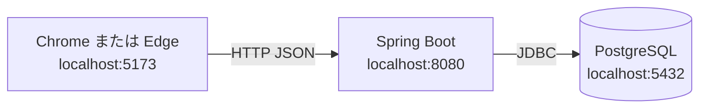

# デプロイガイド

| 項目 | 内容 |
|---|---|
| 文書名 | デプロイガイド |
| 対象システム | 課題管理ボード（Trello風タスク管理アプリ） |
| 版 | 1.0 |
| 作成日 | 2026年10月2日 |
| 改訂日 | 2026年10月2日 |
| 作成者 | nsb |
| 関連資料 | 用語定義書、技術スタック、Spring Boot バックエンド初期セットアップ、操作手順書 |
| 目的 | 手元の Windows に、画面・API・PostgreSQL を置いて起動する手順を示す |

言葉の意味は「用語定義書」に従う。採用する技術と版の正は「技術スタック」である。JDK と Docker Desktop の入れ方は「Spring Boot バックエンド初期セットアップ」を正とする。起動したあとの操作は「操作手順書」である。

この資料のデプロイは、手元のパソコンで一式を起動することである。インターネットへの公開はしない。

---

## 1. 方針

画面、API、PostgreSQL を、それぞれ決めたポートで起動する。ポートが使用中のときは、そのポートを待っているプロセスを止めてから、同じ番号で起動し直す。空いている別のポートへは移さない。

| プロセス | 起動の仕方 | ポート |
|---|---|---|
| PostgreSQL 16 | Docker Compose（`docker-compose.yml`） | 5432 |
| API（Spring Boot） | `backend` で Maven Wrapper | 8080 |
| 画面（Vite の React） | `frontend` で `npm run dev` | 5173 |

画面は `http://localhost:8080` の API を呼ぶ。API は `http://localhost:5173` からの呼び出しだけを許可する。どちらかのポートを変えると、画面からボードを読み書きできない。

ログインは不要である。フォルダ直下の `index.html` は認識合わせ用のモックであり、この手順で起動する本実装ではない。



---

## 2. 用意するもの

| 項目 | 内容 |
|---|---|
| OS | Windows |
| フォルダ | このリポジトリ一式。例: `git clone https://github.com/pfgnsb/kadai-kanri-board.git` |
| JDK | 21。例は Microsoft Build of OpenJDK 21 |
| Docker | Docker Desktop。PostgreSQL はコンテナで動かす。PC への PostgreSQL 個別インストールは不要 |
| Node.js | 20.19.0 以上、または 22.12.0 以上 |
| ブラウザ | Chrome または Edge |
| Maven | 入れなくてよい。`backend/mvnw.cmd` を使う |

PowerShell で次を実行し、それぞれの版が出ることを確認する。

```powershell
java -version
docker version
node -v
```

`java` または `docker` が見つからないときは、「Spring Boot バックエンド初期セットアップ」の入れ方に従う。Node.js が入っていないとき、または版が足りないときは、PowerShell で次を実行し、ウィンドウを開き直してから `node -v` を再度確認する。

```powershell
winget install --id OpenJS.NodeJS.LTS -e --source winget --accept-source-agreements --accept-package-agreements
```

入った版が 20.19.0 未満、または 22.12.0 未満（21 系を含む）のときは、条件を満たす版を入れ直してから先へ進む。

以降のコマンドは、リポジトリのフォルダをカレントにして実行する。

---

## 3. 初回のパッケージ

画面の依存関係は、初回と `frontend/package-lock.json` を更新したあとに入れる。

```powershell
cd frontend
npm ci
```

`node_modules` ができればよい。API のライブラリは、次章の `.\mvnw.cmd spring-boot:run` の初回に Maven が取る。

---

## 4. 起動する

PowerShell を2つ使う。先に API、そのあと画面を起動する。API の起動時に、Spring Boot が `docker-compose.yml` の PostgreSQL を起動する。

### 4.1 Docker Desktop

Docker Desktop を起動し、エンジンが Running になってから次へ進む。

### 4.2 API と PostgreSQL

1つ目の PowerShell で次を実行する。

```powershell
cd backend
.\mvnw.cmd spring-boot:run
```

`java` が見つからないときは、同じウィンドウで次を実行してから、もう一度 `.\mvnw.cmd spring-boot:run` を実行する。

```powershell
$env:JAVA_HOME = "C:\Program Files\Microsoft\jdk-21.0.12.101-hotspot"
$env:Path = "$env:JAVA_HOME\bin;$env:Path"
```

JDK のインストール先が違うときは、`JAVA_HOME` をそのフォルダに合わせる。

初回は Maven のダウンロードと PostgreSQL イメージの取得で時間がかかることがある。ログに `Tomcat started on port 8080` と出れば、API は起動している。このウィンドウは閉じない。

別の PowerShell で接続を確認する。

```powershell
curl.exe -s http://localhost:8080/api/health
```

`{"status":"ok","database":"up"}` と出れば、API から PostgreSQL へつながっている。

### 4.3 画面

2つ目の PowerShell で次を実行する。

```powershell
cd frontend
npm run dev
```

`Local: http://localhost:5173/` と出れば、画面は起動している。このウィンドウも閉じない。

### 4.4 ポートが使用中のとき

8080 または 5173 がすでに使われているときは、待っているプロセスを止めてから、同じ番号で起動し直す。Vite の `strictPort` は外さない。5174 など別番号では起動しない。

```powershell
$conn = Get-NetTCPConnection -LocalPort 8080 -State Listen -ErrorAction SilentlyContinue | Select-Object -First 1
if ($conn) { Stop-Process -Id $conn.OwningProcess -Force }
```

5173 も、`LocalPort` を 5173 に変えて同じ手順で空ける。5432 が他の PostgreSQL で使われているときは、そのプロセスを止めるか、そちらのコンテナを止めてから API を起動し直す。

---

## 5. 動作確認

1. Chrome または Edge で `http://localhost:5173` を開く
2. ボード名「課題管理」と、リスト「未着手」「作業中」「完了」が見える
3. いずれかのリストにカードを1枚追加する
4. ブラウザを再読み込みし、追加したカードが残っている

4までできれば、画面・API・PostgreSQL がつながっている。カードの更新、移動、削除の操作は「操作手順書」に従う。

画面に「API に接続できません。サーバが起動しているか確認してください。」と出るときは、第4.2章の health が `database` `up` であることを先に確認する。

---

## 6. 止める

1. 画面を起動した PowerShell で `Ctrl+C` を押す
2. API を起動した PowerShell で `Ctrl+C` を押す

API を止めても PostgreSQL のコンテナは残る。データは Docker のボリューム `task_board_pgdata` に残る。コンテナも止めるときは、リポジトリのフォルダで次を実行する。

```powershell
docker compose stop
```

保存済みのボードを消して最初からにするときは、次を実行する。ボリュームが消える。

```powershell
docker compose down -v
```

次に API を起動すると、表と初期データが作り直される。

---

## 7. データベースの接続先

初期値は、ホスト `localhost`、ポート `5432`、データベース名 `task_board`、ユーザ `task_board`、パスワード `task_board` である。パスワードは手元専用の初期値であり、提出用の秘密情報ではない。

別の PostgreSQL へつなぐときは、API を起動する PowerShell で次を設定してから `.\mvnw.cmd spring-boot:run` を実行する。未設定の項目は初期値のままである。API の待ち受け 8080 と画面の 5173 は変えない。

```powershell
$env:DB_HOST = "localhost"
$env:DB_PORT = "5432"
$env:DB_NAME = "task_board"
$env:DB_USER = "task_board"
$env:DB_PASSWORD = "task_board"
```

`docker-compose.yml` のデータベース名・ユーザ・パスワードを変えたときは、同じ値をこれらの環境変数にも合わせる。

---

## 8. うまくいかないとき

| 困ったこと | 確認すること |
|---|---|
| `java` が見つからない | JDK 21 を入れる。第4.2章の `JAVA_HOME` を、実際のインストール先に合わせる |
| `docker` が見つからない | Docker Desktop を入れ、起動し、PowerShell を開き直す |
| Docker エンジンが動かない | 「Spring Boot バックエンド初期セットアップ」の WSL 2 の手順に従い、PC を再起動する |
| `node` の版が足りない | 第2章の条件を満たす Node.js を入れ、PowerShell を開き直す |
| `npm ci` が失敗する | `frontend` で実行しているか確認する。`package-lock.json` がある状態で再実行する |
| `/api/health` が開かない | API の PowerShell が動いているか確認する。8080 を第4.4章の手順で空けてから起動し直す |
| `database` が `up` にならない | Docker Desktop が Running か確認する。5432 が空いているか確認する |
| 画面が 5173 以外で開こうとする | 5173 を空けてから `npm run dev` をやり直す。別ポートでは起動しない |
| 画面が API に接続できない | health が `{"status":"ok","database":"up"}` か確認する。画面の URL が `http://localhost:5173` か確認する |
| 再読み込みでカードが消える | 開いているのが `http://localhost:5173` か確認する。フォルダ直下の `index.html` はモックであり、保存先が違う |

---

## 9. 対象外

次はこの資料では行わない。

- インターネット上への公開、クラウドのサーバやマネージドデータベース
- API や画面を Docker イメージにすること。Docker は PostgreSQL 専用である
- 8080、5173、5432 以外のポートで起動すること
- ログインや HTTPS

---

## 10. 改訂履歴

| 版 | 日付 | 内容 |
|---|---|---|
| 1.0 | 2026年10月2日 | 初版。手元の Windows で画面・API・PostgreSQL を起動する手順をまとめた |
