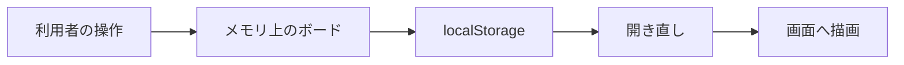

# データベース設計

| 項目 | 内容 |
|---|---|
| 文書名 | データベース設計 |
| 対象システム | 課題管理ボード（Trello風タスク管理アプリ） |
| 版 | 1.3 |
| 作成日 | 2026年9月20日 |
| 改訂日 | 2026年9月23日 |
| 作成者 | nsb |
| 関連資料 | 用語定義書、要件定義書、ER図、機能要件、技術スタック |
| 目的 | いまの保存の形と、論理モデルの項目・約束を決める |

関係の図は「ER図」を正とします。使う技術は「技術スタック」を正とします。  
本実装の保存は PostgreSQL です。フォルダ直下のモックは、まだ localStorage の JSON 1件です。

---

## 1. 保存方式の方針

| 項目 | いまの実装 | 今回しないこと |
|---|---|---|
| 置き場所 | ブラウザの localStorage | サーバ、クラウド、別パソコンへの同期 |
| キー | `task-board-v1` | 複数キー、バージョン移行画面 |
| 形式 | JSON 文字列 1件 | リレーショナルな表への分割 |
| 読み書き | `loadBoard` で読む。`saveBoard` で書く | トランザクション、バックアップ |

操作はメモリ上のボードを直し、そのあと localStorage に書く。開き直すと localStorage を読んで画面を描く。



---

## 2. いまの物理構造（JSON）

ボードはオブジェクト1件。その下にリストの配列。各リストの下にカードの配列。  
並び順は配列の順番で表す。`position` フィールドは持たない。

```json
{
  "title": "課題管理",
  "lists": [
    {
      "id": "（UUID）",
      "title": "未着手",
      "cards": [
        {
          "id": "（UUID）",
          "title": "最初のカード（消してOK）",
          "description": "カードをクリックすると、説明・優先度・期限を編集できます。",
          "priority": "medium",
          "dueDate": ""
        }
      ]
    },
    {
      "id": "（UUID）",
      "title": "作業中",
      "cards": []
    },
    {
      "id": "（UUID）",
      "title": "完了",
      "cards": []
    }
  ]
}
```

### 2.1 ボード（JSON のルート）

| 項目 | 型 | 必須 | 約束 |
|---|---|---|---|
| title | 文字列 | 必須 | 最大40文字。空なら「課題管理」 |
| lists | 配列 | 必須 | リストの配列。無い、または配列でない JSON は初期ボードに戻す |

ボードの `id` はいまの JSON には無い。1件しか持たないため。

### 2.2 リスト（`lists[]`）

| 項目 | 型 | 必須 | 約束 |
|---|---|---|---|
| id | 文字列 | 必須 | `crypto.randomUUID()` で付ける。使えない環境では `id-` 付きの代替 |
| title | 文字列 | 必須 | 最大30文字。空なら変更前の名前 |
| cards | 配列 | 必須 | カードの配列。空配列でもよい |

並びは配列の左から右。新しいリストは末尾（右端）に足す。

### 2.3 カード（`lists[].cards[]`）

| 項目 | 型 | 必須 | 約束 |
|---|---|---|---|
| id | 文字列 | 必須 | リストと同じ方法で付ける |
| title | 文字列 | 必須 | 最大80文字。空では保存できない |
| description | 文字列 | 任意 | 最大500文字。空文字でもよい |
| priority | 文字列 | 必須 | `high` / `medium` / `low` のいずれか。追加時は `medium` |
| dueDate | 文字列 | 任意 | `YYYY-MM-DD`。空文字でもよい。今日より前なら期限切れ |

論理モデルの `due_date` に当たる JSON 名は `dueDate` である。

---

## 3. 識別子と並び順

| 対象 | 識別 | 並び順 |
|---|---|---|
| ボード | JSON ルート1件。id なし | （1件だけ） |
| リスト | `id` | `lists` 配列の順番 |
| カード | `id` | 親リストの `cards` 配列の順番 |

カードを「右へ」すると、元の配列から取り出し、隣のリストの `cards` の末尾へ入れる。

---

## 4. 初期データ

保存が無い、または JSON が使えないときは、次の初期ボードを出す。

| 場所 | 内容 |
|---|---|
| title | 課題管理 |
| リスト1 | 未着手。説明用カード1枚 |
| リスト2 | 作業中。カードなし |
| リスト3 | 完了。カードなし |
| 説明用カード | タイトル「最初のカード（消してOK）」。priority は medium。dueDate は空 |

---

## 5. 項目の約束（論理と物理）

| 対象 | 論理名 | JSON 名 | 約束 |
|---|---|---|---|
| ボード | title | title | 必須。最大40文字。空なら「課題管理」 |
| リスト | title | title | 必須。最大30文字。空なら変更前の名前 |
| カード | title | title | 必須。最大80文字。空では保存できない |
| カード | description | description | 任意。最大500文字 |
| カード | priority | priority | 必須。high / medium / low。画面では高 / 中 / 低。初期値は medium |
| カード | due_date | dueDate | 任意。空でもよい。今日より前なら期限切れ |

---

## 6. 論理モデル（PostgreSQL の表）

本実装では3表に分ける。図は「ER図」を正とする。モックの JSON は入れ子のままである。

| 論理テーブル | 主キー | 外部キー | 備考 |
|---|---|---|---|
| boards | id | なし | 今回の範囲では1件 |
| lists | id | board_id → boards.id | モックの JSON では入れ子のため board_id なし |
| cards | id | list_id → lists.id | モックの JSON では入れ子のため list_id なし |

論理項目 `position`、`created_at`、`updated_at` はモックの JSON には無い。PostgreSQL では並び用に `position` を持つ。

PostgreSQL での目安：

| 項目 | 内容 |
|---|---|
| DBMS | Docker Compose の PostgreSQL。クラウドには置かない |
| テーブル | boards / lists / cards |
| 並び | lists.position、cards.position |
| 削除 | リスト削除時は配下のカードも消す |
| アクセス | Spring Boot から JDBC で SQL を実行する |
| 接続 | `localhost:5432` / データベース `task_board` |
| 表定義 | `backend/src/main/resources/schema.sql` |
| 初期データ | `backend/src/main/resources/data.sql` |

---

## 7. 読み書きの例外

| 状況 | 扱い |
|---|---|
| キーが無い | 初期ボードを出す |
| JSON として読めない | 初期ボードを出す |
| `lists` が配列でない | 初期ボードを出す |
| 容量超過 | 今回の範囲外。専用画面は出さない |
| 別ブラウザ・別パソコン | その環境の localStorage は空。初期ボードになる |

---

## 8. 改訂履歴

| 版 | 日付 | 内容 |
|---|---|---|
| 1.0 | 2026年9月20日 | 初版。要件定義書 2.0 のデータ設計を独立資料にした |
| 1.1 | 2026年9月21日 | 本実装の保存を PostgreSQL の3表とした。SQLite 案は取り下げ |
| 1.2 | 2026年9月22日 | アクセスを Spring Boot の JDBC に変更。接続はこれから |
| 1.3 | 2026年9月23日 | Docker Compose の PostgreSQL と schema.sql を正とした |
