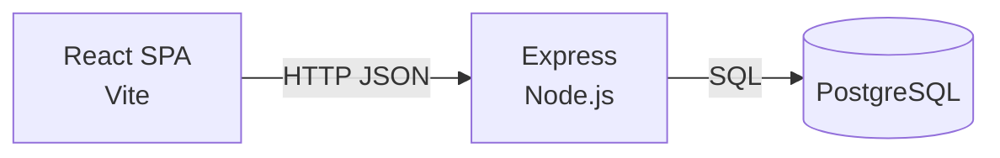
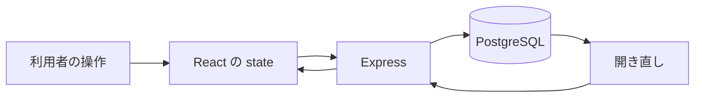

# 技術スタック

| 項目 | 内容 |
|---|---|
| 文書名 | 技術スタック |
| 対象システム | 課題管理ボード（Trello風タスク管理アプリ） |
| 版 | 2.0 |
| 作成日 | 2026年9月20日 |
| 改訂日 | 2026年9月21日 |
| 作成者 | nsb |
| 関連資料 | 用語定義書、要件定義書、データベース設計、操作手順書 |
| 目的 | 採用する技術と、採用しない技術を決める |

何を作るかは「要件定義書」と「機能要件」を正とします。保存の形は「データベース設計」を正とします。  
この資料は、画面に React、保存に PostgreSQL を使うための選定です。Next.js は今回の対象外です。

---

## 1. 全体の組み合わせ

画面は React、サーバは Node.js と Express、保存は PostgreSQL とする。言語は前後とも JavaScript で揃える。この組み合わせは PERN（PostgreSQL / Express / React / Node.js）と呼ぶ。

React は画面（ブラウザ側）で使う。API や SQL は React では扱わない。Next.js は使わないので、画面は Vite で単体の SPA として動かす。

| 層 | 採用するもの | 役割 |
|---|---|---|
| 画面 | React（Vite） | ボードとカード編集の表示・操作 |
| API | Node.js + Express | 画面からの要求を受け、PostgreSQL を読み書きする |
| 保存 | PostgreSQL | ボード・リスト・カードを表で残す |
| 言語 | JavaScript（JSX） | React と同じ言語でサーバも書く |
| パッケージ | npm | 依存関係の導入 |

---

## 2. 提出物と動かし方

提出物はフォルダ一式とする。動かすには Node.js と PostgreSQL が必要である。

| 場所 | 役割 |
|---|---|
| `frontend/` | React の画面。Vite で開発・ビルドする |
| `backend/` | Express の API。PostgreSQL へつなぐ |
| `ドキュメント/` | 用語・要件・画面・本資料など |

動かす手順の目安は次のとおり。詳細な操作は「操作手順書」を正とする。

1. PostgreSQL を起動し、課題用のデータベースを用意する
2. `backend` で `npm install` のあと、API サーバを起動する
3. `frontend` で `npm install` のあと、Vite の開発サーバを起動する
4. Chrome または Edge で画面の URL を開く

ログインは不要。クラウドへのデプロイは対象外である。手元のパソコンで動かす。

いまフォルダ直下にある `index.html`、`styles.css`、`app.js` は、認識合わせ用のモックである。本実装の正は React + Express + PostgreSQL とする。

---

## 3. 採用するもの

| 採用するもの | 層 | 理由 |
|---|---|---|
| React | 画面 | 指定。ボード・リスト・カードをコンポーネントに分けて組む |
| Vite | 画面 | Next.js を使わない React の標準的な開発サーバ。JSX をそのまま扱える |
| CSS | 画面 | 見た目。追加の UI ライブラリは使わない |
| `fetch` | 画面 | ブラウザ標準で API を呼ぶ |
| Node.js | API | React と同じ JavaScript でサーバを動かす |
| Express | API | Node.js で JSON の REST API を書く定番 |
| `pg` | API | PostgreSQL 公式寄りのドライバ。SQL が見える |
| PostgreSQL | 保存 | 指定。リストとカードを表に分けて残す |
| npm | 共通 | Node.js のパッケージ管理 |
| Chrome または Edge | 実行 | 提出と説明で使うブラウザ |

画面の状態は React のコンポーネントで持つ。残す処理は API 経由で PostgreSQL に書く。ブラウザの localStorage は主保存に使わない。

---

## 4. 実行環境

| 項目 | 内容 |
|---|---|
| OS | Windows のパソコン |
| ブラウザ | Chrome または Edge |
| ランタイム | Node.js（LTS） |
| パッケージ管理 | npm |
| 画面の開発サーバ | Vite（例: `http://localhost:5173`） |
| API サーバ | Express（例: `http://localhost:3000`） |
| データベース | 手元の PostgreSQL |
| ネットワーク | 開発中は localhost。インターネット上の公開はしない |
| ビルド | 画面は Vite。提出説明では開発サーバでもよい |

Safari や Firefox での動作保証、スマートフォン専用アプリ、クラウド公開は対象外である。

---

## 5. 画面まわりの技術（React）

| 項目 | 内容 |
|---|---|
| ライブラリ | React。関数コンポーネントと Hooks（`useState` / `useEffect`） |
| 開発・バンドル | Vite |
| ルーティング | 使わない。画面はボード1枚と、重ねて開くカード編集だけ |
| 状態 | ボードデータは API から取得し、コンポーネントの state で持つ |
| 見た目 | CSS。Tailwind やコンポーネントライブラリは使わない |
| 編集画面 | 重ねて開く編集。実装は React の要素で足りる |
| 日付 | `<input type="date">` |
| 確認 | 削除前は確認する |

Next.js の App Router、Server Components、`getServerSideProps` などは使わない。画面はブラウザで動く SPA とする。

画面の部品と動きの正は「画面設計書」とする。

---

## 6. API まわりの技術（Express）

| 項目 | 内容 |
|---|---|
| サーバ | Express on Node.js |
| 形式 | REST。JSON で返す |
| 画面とのつなぎ | 開発中は CORS を許可し、`fetch` で呼ぶ |
| DB 接続 | `pg`（接続プール） |
| 設定 | 接続先は環境変数（ホスト、ポート、データベース名、ユーザ）。秘密情報はリポジトリに置かない |
| 認証 | なし。今回は一人・手元利用 |

API は画面と PostgreSQL の間に置く。SQL をブラウザから直接発行しない。

エンドポイントの詳細は実装時に決める。対象はボード・リスト・カードの取得と更新である。

---

## 7. 保存まわりの技術（PostgreSQL）

| 項目 | 内容 |
|---|---|
| DBMS | PostgreSQL |
| 置き場所 | 手元のパソコン。クラウドのマネージド DB は使わない |
| 表 | boards / lists / cards。項目と制約は「データベース設計」を正とする |
| アクセス | Express から `pg` で SQL を実行する |
| ID | UUID |
| 並び | リストとカードの順番は表の列で持つ |

localStorage と SQLite は、この版の主保存には使わない。  
データの項目と例外は「データベース設計」を正とする。

---

## 8. 採用しないもの

| 採用しないもの | 理由 |
|---|---|
| Next.js | 今回の指定で対象外。画面は Vite の React SPA とする |
| Create React App | メンテナンスが止まっている。Vite で足りる |
| TypeScript | 前後とも JavaScript で揃える。今回の提出範囲では型の導入はしない |
| Prisma / ORM | SQL の形が見えにくくなる。`pg` で足りる |
| Redux などの状態ライブラリ | ボード1枚の状態に対して準備が重い |
| Tailwind などの CSS フレームワーク | 既存の見た目方針に、プレーンな CSS で足りる |
| ドラッグ用のライブラリ | 「左へ」「右へ」と、標準のポインタ操作で足りる |
| SQLite | 保存は PostgreSQL に決めた |
| localStorage（主保存） | 表での保存に切り替える |
| クラウド上のデータベース | ネットとアカウントが要る。手元の PostgreSQL で足りる |
| Docker | 今回の実行は手元インストールで足りる |

---

## 9. 改訂履歴

| 版 | 日付 | 内容 |
|---|---|---|
| 1.0 | 2026年9月20日 | 初版。HTML / CSS / JS と localStorage。要件定義書 2.0 の技術選定を独立資料にした |
| 2.0 | 2026年9月21日 | 画面を React（Vite）、API を Express、保存を PostgreSQL に変更。Next.js は対象外 |
