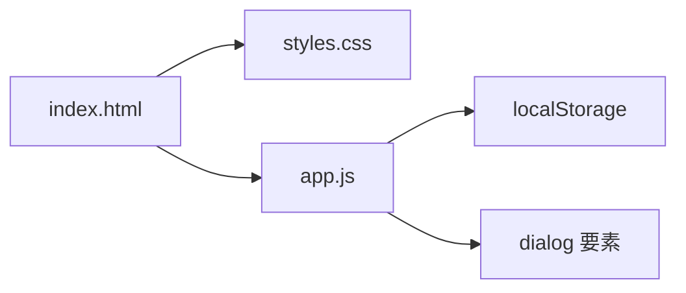

# 技術スタック

| 項目 | 内容 |
|---|---|
| 文書名 | 技術スタック |
| 対象システム | 課題管理ボード（Trello風タスク管理アプリ） |
| 版 | 1.0 |
| 作成日 | 2026年9月20日 |
| 作成者 | nsb |
| 関連資料 | 用語定義書、要件定義書、データベース設計、操作手順書 |
| 目的 | 採用する技術と、採用しない技術を決める |

何を作るかは「要件定義書」と「機能要件」を正とします。保存の形は「データベース設計」を正とします。

---

## 1. 提出物と動かし方

提出物はフォルダ一式とする。ビルドやインストールは不要である。

| ファイル | 役割 |
|---|---|
| `index.html` | 画面の骨格。ボード画面とカード編集の dialog |
| `styles.css` | 色と配置 |
| `app.js` | 操作・描画・保存 |
| `ドキュメント/` | 用語・要件・画面・本資料など |

動かす手順は、Chrome または Edge で `index.html` を直接開く。ログインもサーバも不要。インターネットも不要。

---

## 2. 採用するもの

| 採用するもの | 役割 | 理由 |
|---|---|---|
| HTML | 画面構造 | ブラウザでそのまま開ける |
| CSS | 見た目 | ライブラリなしで足りる |
| JavaScript（ライブラリなし） | 操作と保存 | 仕組みが見える。ビルドしなくてよい |
| localStorage | 同じブラウザへの保存 | サーバなしで内容を残せる。キーは `task-board-v1` |
| dialog 要素 | カード編集画面 | 重ねて開く編集に、ブラウザ標準で足りる |
| Chrome または Edge | 実行環境 | 提出と説明で使う環境 |

---

## 3. 実行環境

| 項目 | 内容 |
|---|---|
| OS | Windows のパソコン |
| ブラウザ | Chrome または Edge |
| ネットワーク | ファイルを開いたあとは不要 |
| ランタイム | ブラウザのみ。Node.js は使わない |
| パッケージ管理 | 使わない（npm / yarn なし） |
| ビルド | しない |

Safari や Firefox での動作保証、スマートフォン専用アプリ、インストール必須の配布は対象外である。

---

## 4. 保存まわりの技術

| 項目 | 内容 |
|---|---|
| API | `localStorage.getItem` / `setItem` |
| キー | `task-board-v1` |
| 中身 | JSON 文字列 |
| 読み込み関数 | `loadBoard` |
| 書き込み関数 | `saveBoard` |
| ID | `crypto.randomUUID()`。無いときは `id-` 付きの代替 |

データの項目と例外は「データベース設計」を正とする。

---

## 5. 画面まわりの技術

| 項目 | 内容 |
|---|---|
| 描画 | `app.js` が HTML 文字列を組み立て、`innerHTML` で出す |
| 入力の表示 | `escapeHtml` でエスケープしてから出す |
| 編集画面 | `<dialog id="card-dialog">`。`showModal()` で開く |
| 日付 | `<input type="date">` |
| 確認 | `confirm()` |

画面の部品と動きの正は「画面設計書」とする。

---

## 6. 採用しないもの

| 採用しないもの | 理由 |
|---|---|
| React などの UI ライブラリ | 画面が2つだけの課題に対して準備が重い |
| Node.js などのサーバ | いまはファイルを開くだけでよい |
| npm などのパッケージ | 提出物をフォルダのまま開ける方針と合わない |
| クラウド上のデータベース | ネットとアカウントが要る。一人用・オフラインの方針と合わない |
| SQLite（いま） | 今回の保存は localStorage。表分割は未実装 |
| ドラッグ用のライブラリ | 「左へ」「右へ」で足りる。つかんで移す操作は対象外 |
| TypeScript | ビルドが要る。今回の提出物には含めない |

---

## 7. 将来足す案（今回の範囲外）

本当の表（RDB）の操作を課題に入れるときは、SQLite と手元のローカルサーバを足す案がある。  
それは次の改訂であり、いまの実装範囲ではない。論理モデルは「ER図」と「データベース設計」に書いてある。

---

## 8. 改訂履歴

| 版 | 日付 | 内容 |
|---|---|---|
| 1.0 | 2026年9月20日 | 初版。要件定義書 2.0 の技術選定を独立資料にした |
