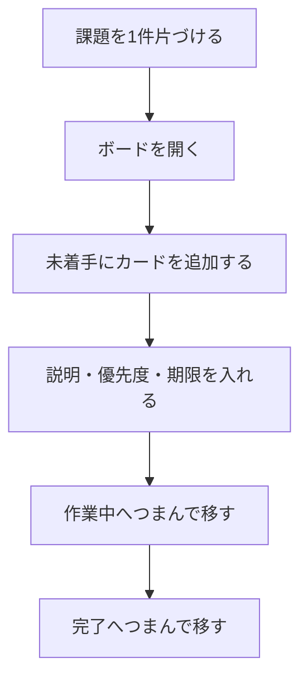
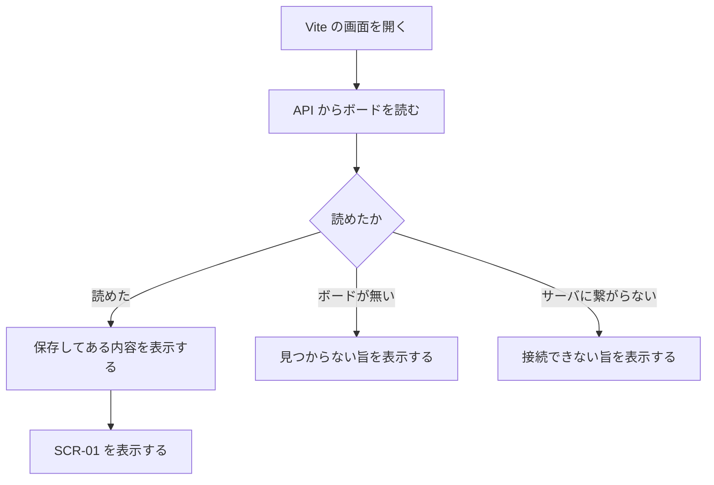
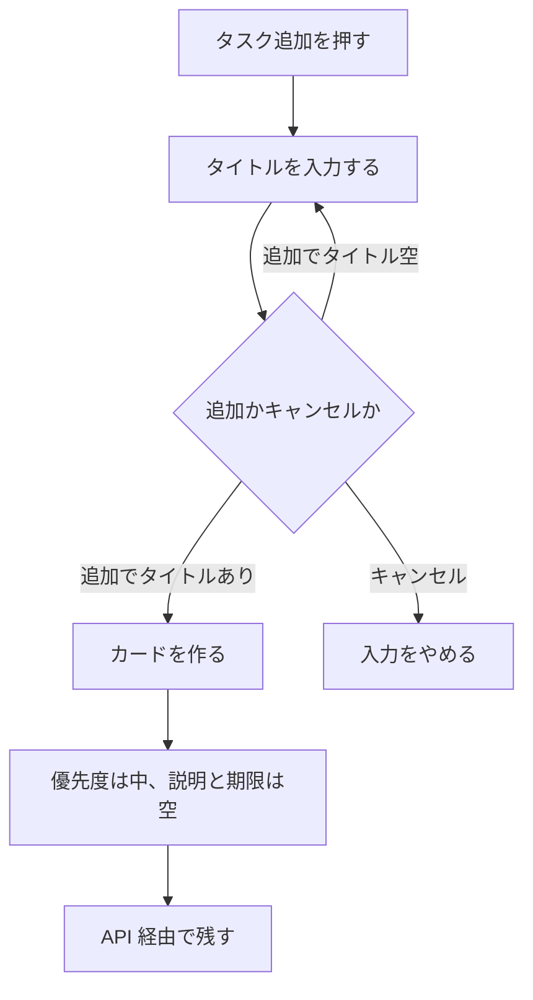
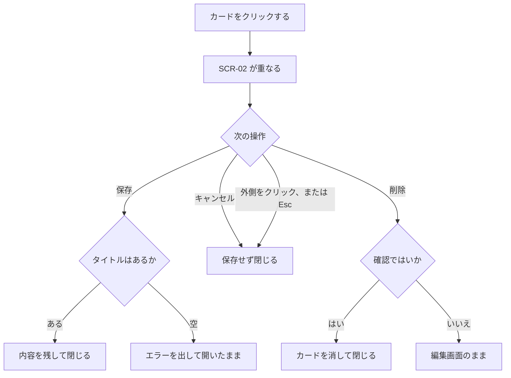
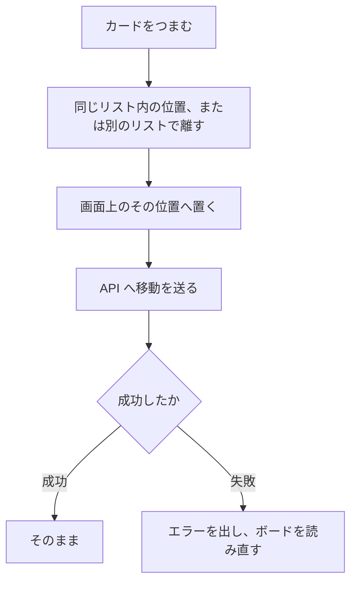
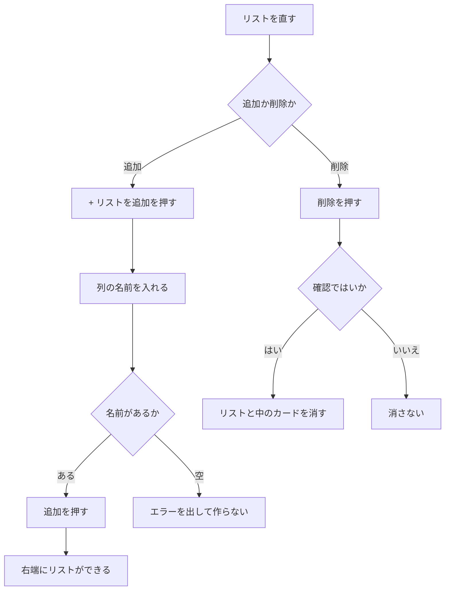

# 機能要件定義書

| 項目 | 内容 |
|---|---|
| 文書名 | 機能要件定義書 |
| 対象システム | 課題管理ボード（Trello風タスク管理アプリ） |
| 版 | 1.8 |
| 作成日 | 2026年9月20日 |
| 改訂日 | 2026年9月26日 |
| 作成者 | nsb |
| 関連資料 | 用語定義書、要件定義書、機能要件、画面設計書、画面見取り図、操作手順書 |
| 目的 | 本システムでユーザーが達成できること（機能の範囲・流れ・完成の定義）をまとめる |

この資料は、プログラムを書く前に決める「機能の約束」です。言葉の意味は「用語定義書」に従います。  
番号付きの要件一覧の正は「機能要件」とします。何を作るか・何を作らないかの全体方針は「要件定義書」を正とします。

---

## 1. システムの目的（機能面）

自分のやることをカードに書き、リスト（列）で進み具合を見て管理する。  
Trelloのように、1枚のボードの上でカードを左から右へ移していく。

| 項目 | 内容 |
|---|---|
| 対象 | 一人が、手元のブラウザで、課題をカードとして管理すること |
| 中心の操作 | カードの追加・編集・削除・つまんで移動、リストの追加・削除。ボード名とリスト名は見出しとして出す |
| 保存 | 追加・更新・削除・移動の結果を、API 経由で PostgreSQL に残す |

---

## 2. 利用者と利用の前提

| 項目 | 内容 |
|---|---|
| 利用者 | nsb 一人。ログインはない |
| 画面 | メインはボード画面（SCR-01）1枚。カード編集時だけ重ねて開く（SCR-02） |
| 動かす場所 | 自分のパソコンの Chrome または Edge。Vite の画面（`http://localhost:5173`）を開く |
| ネットワーク | インターネット上の公開はしない。手元の API と PostgreSQL が動いている必要がある |
| 共有 | 他の人との同時利用・招待はない |

---

## 3. 機能の範囲

### 3.1 今回作る機能（概要）

| 分類 | できること |
|---|---|
| ボード | 起動時に1枚表示する。名前は見出しで、書き換えない |
| リスト | 初期3列を出す。追加・削除する。名前は見出しで、書き換えない |
| カード | 追加・編集・削除する。つまんで、同じリスト内の位置または別のリストへ置く |
| カードの項目 | タイトル（必須）、説明文、優先度、期限 |
| 保存 | API 経由で PostgreSQL に残す |

詳細な番号（B-1、L-1、C-1、S-1 など）は「機能要件」を正とする。

### 3.2 今回作らない機能

次は機能の対象外とする。必要になったら要件定義書を改訂してから追加する。

- ログイン、会員登録
- 複数人での共有、招待、権限
- 複数ボード
- ボード名の変更、リスト名の変更
- 「優先度順」「期限順」のボタン
- コメント、チェックリスト、ファイル添付
- 通知、メール
- スマートフォン専用アプリ
- 別のパソコンへの自動同期
- SQLite、クラウド保存
- 保存容量超過の専用画面
- 運用ログ、監視

---

## 4. 機能分類と画面の対応

| 分類 | 主な操作 | 画面 |
|---|---|---|
| ボード | 表示。名前は見出し | SCR-01 |
| リスト | 追加、削除。名前は見出し | SCR-01 |
| カード | 追加、つまんで移動 | SCR-01 |
| カード | 編集、削除 | SCR-02（SCR-01 の上に重なる） |
| 保存 | API 経由で残す、開き直して復元する | 画面操作に付随する。専用画面は無い |

カードをつまんで置く操作は画面遷移ではない。同じボード画面の中で、所属リストと並び順を変える。

---

## 5. 機能ごとの定義

### 5.1 ボード

起動するとボード1枚だけを出す。左上の名前は見出しであり、書き換えない。初期値は「課題管理」。最大40文字はデータベースの制約である。

### 5.2 リスト

API の初期データでは「未着手」「作業中」「完了」の3つを出す。未着手にカード2枚、作業中に1枚、完了に1枚ある。  
「リストを追加」から名前を入れて右端に作る。空の名前では作れない。列の上部の名前は見出しであり、書き換えない。削除の前に確認し、中のカードも一緒に消える。リスト名は最大30文字。

### 5.3 カード

タイトルを入れて追加する。優先度の初期値は「中」。説明文と期限は空。  
カードをクリックすると編集画面が開き、タイトル・説明文・優先度・期限を直せる。削除は編集画面から行い、確認のあと消す。  
カードをつまんで、同じリスト内の好きな位置、または別のリストへ置く。少し動かさずに離すと、クリックとして編集画面が開く。

### 5.4 カードの項目

| 項目 | 必須 / 任意 | 約束 |
|---|---|---|
| タイトル | 必須 | 最大80文字。空では保存できない |
| 説明文 | 任意 | 最大500文字。空でもよい |
| 優先度 | 必須 | 高 / 中 / 低。追加時の初期値は中 |
| 期限 | 任意 | 日付。空でもよい。今日より前なら期限切れとして分かりやすく表示する |

### 5.5 保存

リストとカードの追加・変更・削除・移動は、Spring Boot の API 経由で PostgreSQL に残す。PostgreSQL は Docker Compose で起動する。  
同じデータベースなら、開き直しても前回の内容になる。ボードの行が無いときは「ボードが見つかりません。」と出す。API に繋がらないときは、接続を確認する旨を出す。  
追加と更新と削除は、API が成功してから画面を確定する。移動は、画面の並びを先に変え、API が失敗したらエラーを出してボードを読み直す。  
保存容量を超えたときの専用画面は出さない。

---

## 6. ユースフローと操作フロー

- **ユースフロー**：やりたいことを達成する道筋
- **操作フロー**：画面上のクリックなどの手順

図の部品の詳細は画面設計書を正とする。機能番号の正は「機能要件」とする。

### 6.1 全体（課題を1件片づける）

| 項目 | 内容 |
|---|---|
| 種類 | ユースフロー |
| 対応する機能 | B-1、C-1、C-2、C-4、S-1、S-2 |

### 6.2 UF-1 起動する

| 項目 | 内容 |
|---|---|
| 種類 | 操作フロー |
| 対応する機能 | B-1、L-1、S-2 |

初期データは、リスト「未着手」「作業中」「完了」と、未着手2枚・作業中1枚・完了1枚のカードである。中身の正は `data.sql` とする。

### 6.3 UF-2 カードを追加する

| 項目 | 内容 |
|---|---|
| 種類 | 操作フロー |
| 対応する機能 | C-1、S-1 |

### 6.4 UF-3 カードを編集する

| 項目 | 内容 |
|---|---|
| 種類 | 操作フロー |
| 対応する機能 | C-2、C-3、S-1 |

保存・キャンセル・外側クリック・Esc・削除がある。外側クリックと Esc は、保存せずに閉じる。

### 6.5 UF-4 カードを移動する

| 項目 | 内容 |
|---|---|
| 種類 | 操作フロー |
| 対応する機能 | C-4、S-1 |

カードをつまんで置く操作は画面遷移ではない。同じボード画面の中で、所属リストと並び順を変える。少し動かさずに離すと、移動せずに編集画面が開く。画面の並びは先に変わり、そのあと API へ送る。失敗したときはエラーを出してボードを読み直す。

### 6.6 UF-5 リストを追加・削除する

| 項目 | 内容 |
|---|---|
| 種類 | 操作フロー |
| 対応する機能 | L-2、L-4、S-1 |

リスト名の書き換えはしない。

確認のあと消した内容は元に戻らない。追加と削除は、API が成功してから画面を確定する。

---

## 7. 完成の定義

確認する人は利用者の nsb。環境は手元の PostgreSQL と Spring Boot、React（Vite）を起動し、Chrome または Edge で `http://localhost:5173` を開くこと。

次をすべて満たせば、機能面の最初の完成とする。

1. 初期データではリストが3つある
2. カードを追加・編集・削除できる
3. カードにタイトル・説明文・優先度を付けられる
4. 期限は入れることも、空にすることもできる
5. カードをつまんで、同じリスト内の位置または別のリストへ移せる
6. リストを追加・削除できる。ボード名とリスト名は書き換えない
7. ページを開き直しても内容が消えない（同じパソコンの PostgreSQL）

対象外の機能が無いことは、不合格にしない。

---

## 8. 資料の使い分け

| 資料 | この資料との違い |
|---|---|
| 要件定義書 | 背景・非機能・対象外を含む全体の約束。本資料より広い |
| 機能要件 | 機能を番号付きの一覧にした確認用の表。本資料の詳細の正 |
| 画面設計書 | 部品の配置と動きの正 |
| ER図・データベース設計 | データの形。機能の中身そのものではない |
| 技術スタック | 使う技術の選定。機能の中身そのものではない |

機能の範囲を変えるときは、先に要件定義書と本資料を直し、機能要件の番号表も直す。

---

## 9. 改訂履歴

| 版 | 日付 | 内容 |
|---|---|---|
| 1.0 | 2026年9月20日 | 初版。要件定義書 2.0 の機能に関する部分を独立資料にした |
| 1.1 | 2026年9月22日 | 本実装の保存を Spring Boot 経由の PostgreSQL とした。サーバを対象外から外した |
| 1.2 | 2026年9月23日 | PostgreSQL 接続を Docker Compose 経由で開始した |
| 1.3 | 2026年9月26日 | リストとカードの追加 API を実装済みとした。変更・削除・移動は未実装のまま |
| 1.4 | 2026年9月26日 | カード追加の操作フローのボタン名を「タスク追加」にした |
| 1.5 | 2026年9月26日 | カードの更新と左右移動の API を実装済みとした。削除は未実装のまま |
| 1.6 | 2026年9月26日 | カードの移動を、つまんで置く操作にした |
| 1.7 | 2026年9月26日 | リストとカードの削除 API を実装済みとした |
| 1.8 | 2026年9月26日 | 実装に合わせ、ボード名とリスト名の変更、優先度順・期限順、index.html 直開きを外した。初期データと移動失敗時の読み直しを書いた |
