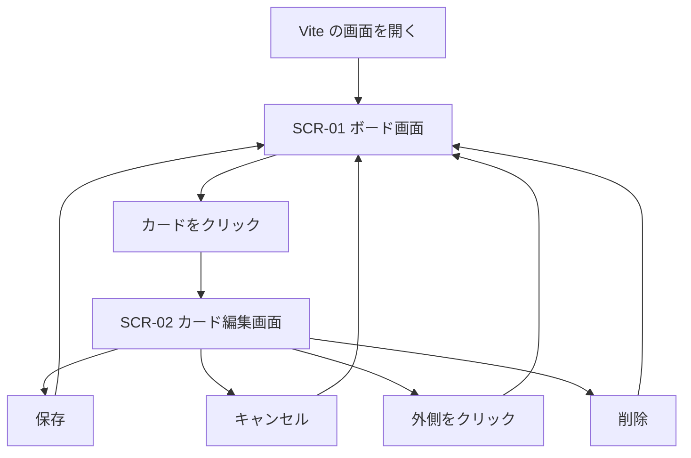

# 画面設計書

| 項目 | 内容 |
|---|---|
| 文書名 | 画面設計書 |
| 対象システム | 課題管理ボード（Trello風タスク管理アプリ） |
| 作成日 | 2026年9月18日 |
| 作成者 | nsb |
| 関連資料 | 用語定義書、要件定義書、画面見取り図 |
| 目的 | 画面の配置と、各部品の役割を決める |

言葉の意味は「用語定義書」に従います。作る機能の範囲は「要件定義書」に従います。  
画面の見た目を先につかむときは「画面見取り図」を見ます。

---

## 1. 画面一覧

本システムは画面を1枚とし、カード編集時だけ小さな画面を重ねて開く。

| 画面ID | 画面名 | 種類 | 説明 |
|---|---|---|---|
| SCR-01 | ボード画面 | メイン画面 | 起動後に常に表示する。リストとカードを操作する |
| SCR-02 | カード編集画面 | 重ねて開く画面 | カードをクリックしたときに開く。内容の確認・変更・削除をする |

### 1.1 画面遷移

起動するとボード画面（SCR-01）だけを出す。カード編集画面（SCR-02）は、カードをクリックしたときだけボードの上に重なる。

カードをつまんで置く操作は、同じボード画面の中で所属リストや並び順を変えるものであり、画面遷移ではない。



---

## 2. ボード画面（SCR-01）

### 2.1 画面レイアウト

```
+------------------------------------------------------------------+
| ボード名                                          保存の説明 |
+------------------------------------------------------------------+
| +------------+  +------------+  +------------+  +--------------+ |
| | リスト名 削除|  | リスト名 削除|  | リスト名 削除|  | + リストを追加| |
| |            |  |            |  |            |  |              | |
| | カード      |  | （空の表示） |  | （空の表示） |  |              | |
| |  優先度     |  |            |  |            |  |              | |
| |            |  |            |  |            |  |              | |
| | タスク追加  |  | タスク追加  |  | タスク追加  |  |              | |
| +------------+  +------------+  +------------+  +--------------+ |
+------------------------------------------------------------------+
```

- 背景は青緑
- リストは灰色の縦長の枠
- カードは白い小さな枠
- リストが増えたときは、横にスクロールして見る

### 2.2 画面上部

| No. | 部品名 | 種類 | 初期値 | 動作 |
|---|---|---|---|---|
| 1 | ボード名 | 見出し | 課題管理 | 左上に出す。書き換えない |
| 2 | 保存の説明 | 文字 | 追加や更新はサーバに残ります | 押しても何も起きない。サーバに残ることを伝える |

### 2.3 リスト

| No. | 部品名 | 種類 | 動作 |
|---|---|---|---|
| 3 | リスト名 | 見出し | 列の上部に出す。書き換えない |
| 4 | 削除 | ボタン | 押すと確認が出る。はいを選ぶと、そのリストと中のカードを消す |
| 5 | 空の表示 | 文字 | カードが1枚もないとき「カードはまだありません」と出す |
| 6 | タスク追加 | ボタン | 押すと、そのリストの下にタイトル入力欄が出る |
| 7 | カードのタイトル入力 | 入力欄 | 「カードのタイトル」と薄く表示する。最大80文字 |
| 8 | 追加（カード） | ボタン | タイトルが入っていればカードを作る。空なら「タイトルを入力してください。」と出す。優先度は「中」、説明文と期限は空 |
| 9 | キャンセル（カード） | ボタン | 入力をやめて、元の「タスク追加」に戻す |

### 2.4 カード

カード本体をクリックすると、カード編集画面（SCR-02）が開く。  
カードをつまんで動かすと移動する。少し動かさずに離すと、クリックとして編集画面が開く。

| No. | 部品名 | 種類 | 動作 |
|---|---|---|---|
| 10 | カード全体 | 枠 | クリックで編集画面を開く。つまんで、同じリスト内の位置または別のリストへ置く |
| 11 | カードのタイトル | 文字 | カードに付けた短い名前を出す |
| 12 | 優先度 | 色つきの印 | 「優先度 高 / 中 / 低」を出す |
| 13 | 期限 | 文字 | 期限があるときだけ「期限」のあとに「年」「月」「日」を付けた日付を出す。今日より前なら赤字にする |
| 14 | 説明文の一部 | 文字 | 説明文があるときだけ、2行まで出す。それより長いときは隠す |
| 15 | （なし） | - | 「左へ」「右へ」ボタンは使わない |
| 16 | （なし） | - | 移動はカードをつまんで行う |

### 2.5 リスト追加

| No. | 部品名 | 種類 | 動作 |
|---|---|---|---|
| 17 | + リストを追加 | ボタン | 右端にあり、押すとリスト名の入力欄が出る |
| 18 | リスト名入力 | 入力欄 | 「列の名前」と薄く表示する。最大30文字 |
| 19 | 追加（リスト） | ボタン | 名前が入っていれば、右端に新しいリストを作る。空なら「列の名前を入力してください。」と出す |
| 20 | キャンセル（リスト） | ボタン | 入力をやめて、元の「+ リストを追加」に戻す |

### 2.6 初期表示

データベースに初期データを入れた直後のボード画面は次のとおり。利用者が消したり足したりしたあとは、PostgreSQL に残っている内容を出す。

| 場所 | 内容 |
|---|---|
| ボード名 | 課題管理 |
| 左のリスト | 未着手。カード2枚 |
| 真ん中のリスト | 作業中。カード1枚 |
| 右のリスト | 完了。カード1枚 |
| 未着手の1枚目 | タイトル「最初のカード（消してOK）」。優先度は中。使い方の説明文あり。期限なし |
| 未着手の2枚目 | タイトル「期限のある高優先度カード」。優先度は高。期限は 2026年10月1日 |
| 作業中 | タイトル「作業中のカード」。優先度は中。期限なし |
| 完了 | タイトル「完了したカード」。優先度は低。期限は 2026年9月1日。今日より前なので赤字 |

### 2.7 読み込みと失敗

ボードを出す前と、操作が失敗したときは、次を出す。

| 状況 | 表示 |
|---|---|
| 読み込み中 | 「読み込み中です。」 |
| API に繋がらない | 「API に接続できません。サーバが起動しているか確認してください。」 |
| ボードが無い | 「ボードが見つかりません。」 |
| それ以外でボードを読めない | 「ボードを読み込めませんでした。」 |
| 移動や削除に失敗した | ボードの上に、失敗した操作の文言 |

---

## 3. カード編集画面（SCR-02）

### 3.1 画面レイアウト

```
+------------------------------+
| カードを編集                 |
| タイトル（必須）  [        ] |
| 説明文            [        ] |
| 優先度            [中     v] |
| 期限（任意）      [日付    ] |
|                              |
| [保存] [キャンセル]   [削除] |
+------------------------------+
```

ボード画面の上に重ねて開く。周りの暗い部分をクリックするか、Esc を押すと、保存せずに閉じる。

### 3.2 部品

| No. | 部品名 | 種類 | 必須 | 動作 |
|---|---|---|---|---|
| 21 | 見出し | 文字 | - | 「カードを編集」と出す |
| 22 | タイトル | 入力欄 | 必須 | 最大80文字。空のまま保存するとエラーを出す |
| 23 | 説明文 | 入力欄 | 任意 | 最大500文字。空でもよい |
| 24 | 優先度 | 選択肢 | 必須 | 高 / 中 / 低 から1つ選ぶ |
| 25 | 期限 | 日付の入力 | 任意 | カレンダーから日付を選ぶ。空でもよい |
| 26 | エラー文 | 文字 | - | タイトルが空のとき「タイトルを入力してください。」を出す |
| 27 | 保存 | ボタン | - | 内容をカードへ反映し、画面を閉じる |
| 28 | キャンセル | ボタン | - | 変更せずに画面を閉じる |
| 29 | 削除 | ボタン | - | 確認のあと、カードを消し、画面を閉じる |

---

## 4. 色と見た目の約束

| 対象 | 色 | 意味 |
|---|---|---|
| 画面の背景 | 青緑 | ボード全体 |
| リスト | 薄い灰色 | 列 |
| カード | 白 | 1つのやること |
| 優先度 高 | 赤 | 先にやる |
| 優先度 中 | 黄 | 普通 |
| 優先度 低 | 灰 | 後回し |
| 期限切れ | 赤文字 | 期限の日付が今日より前 |

---

## 5. 確認メッセージ

| タイミング | メッセージ |
|---|---|
| リストを削除するとき | 「（リスト名）」を削除しますか？中のカードも消えます。 |
| カードを削除するとき | 「（カードのタイトル）」を削除しますか？ |

はいを選ぶと削除する。いいえを選ぶと何もしない。Esc を押すと、いいえと同じになる。

---

## 6. 改訂履歴

| 版 | 日付 | 内容 |
|---|---|---|
| 1.0 | 2026年9月18日 | 初版。実装した画面に合わせて部品を定義した |
| 1.1 | 2026年9月18日 | 関連資料に画面見取り図を追加した |
| 1.2 | 2026年9月19日 | 画面一覧のあとに画面遷移図を追加した |
| 1.3 | 2026年9月26日 | カード追加ボタンの表示を「タスク追加」にした |
| 1.4 | 2026年9月26日 | 「左へ」「右へ」をやめ、カードをつまんで移動するようにした |
| 1.5 | 2026年9月26日 | 実装に合わせ、ボード名とリスト名を見出しにした。保存の説明、初期データ、読み込み失敗を直した |
