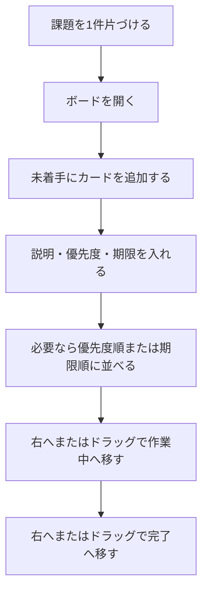
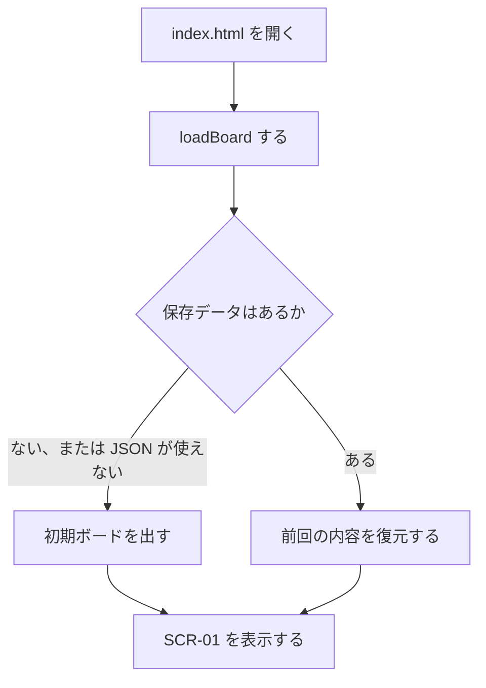
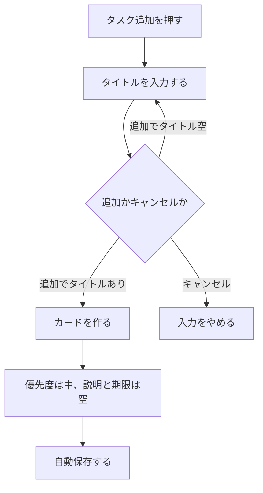
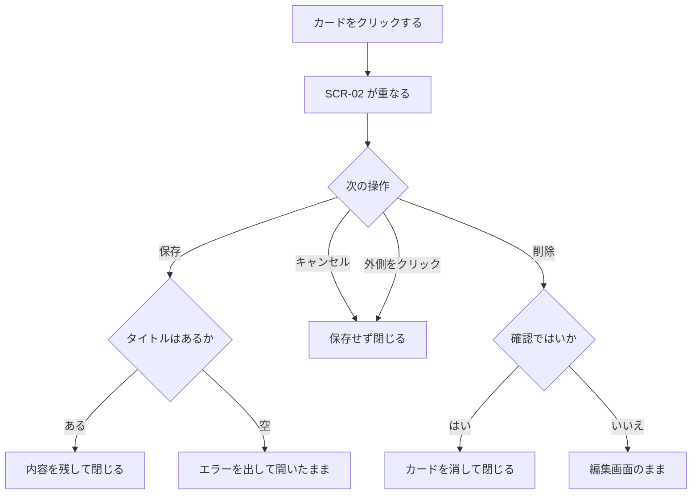
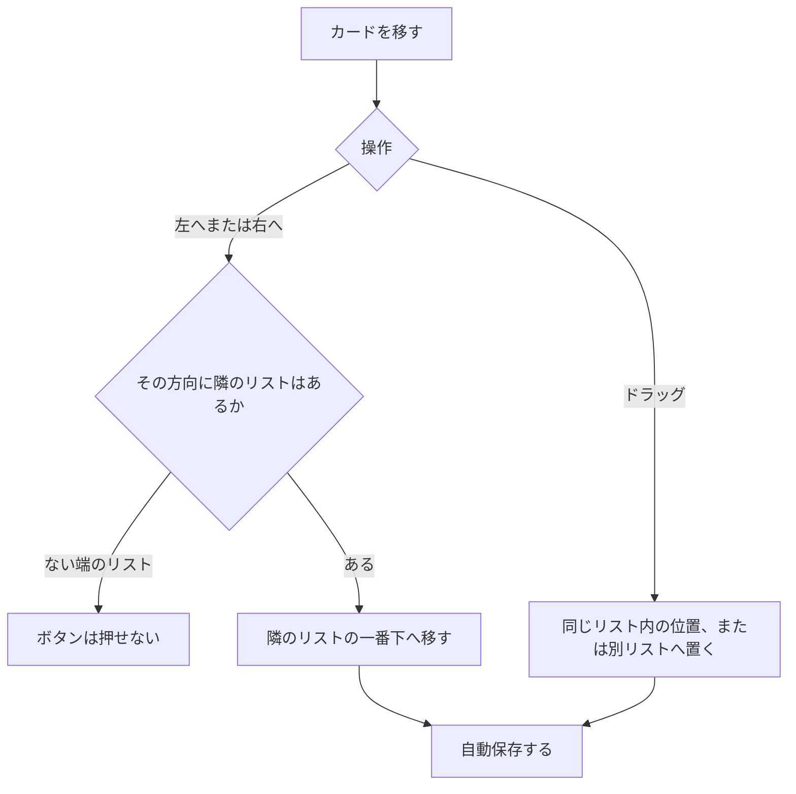
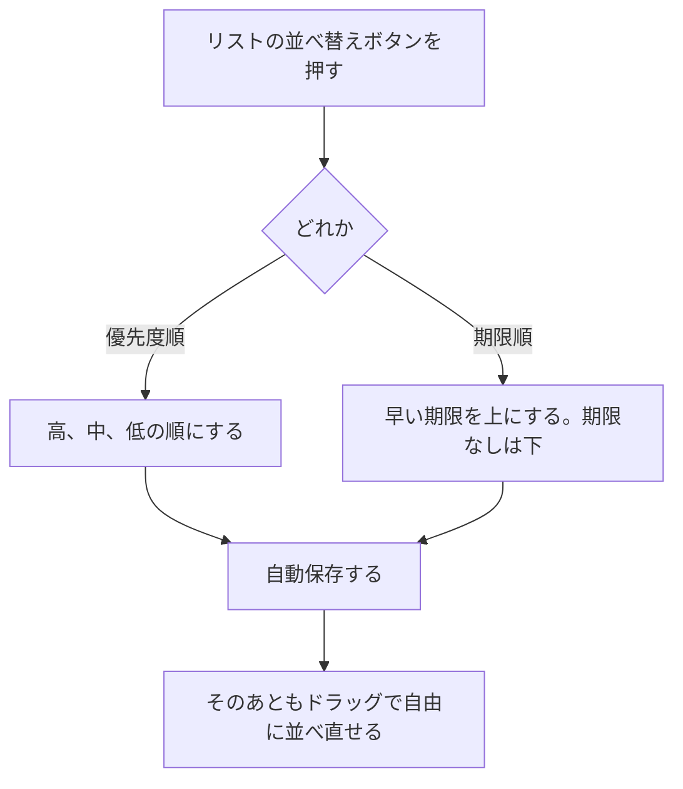
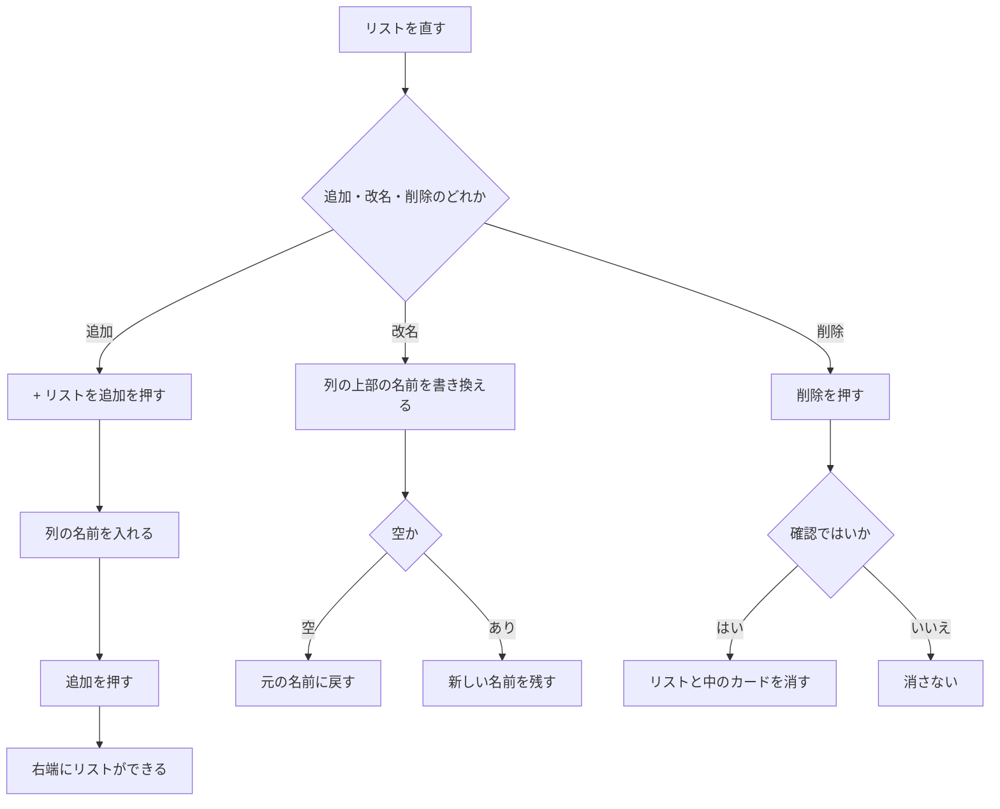
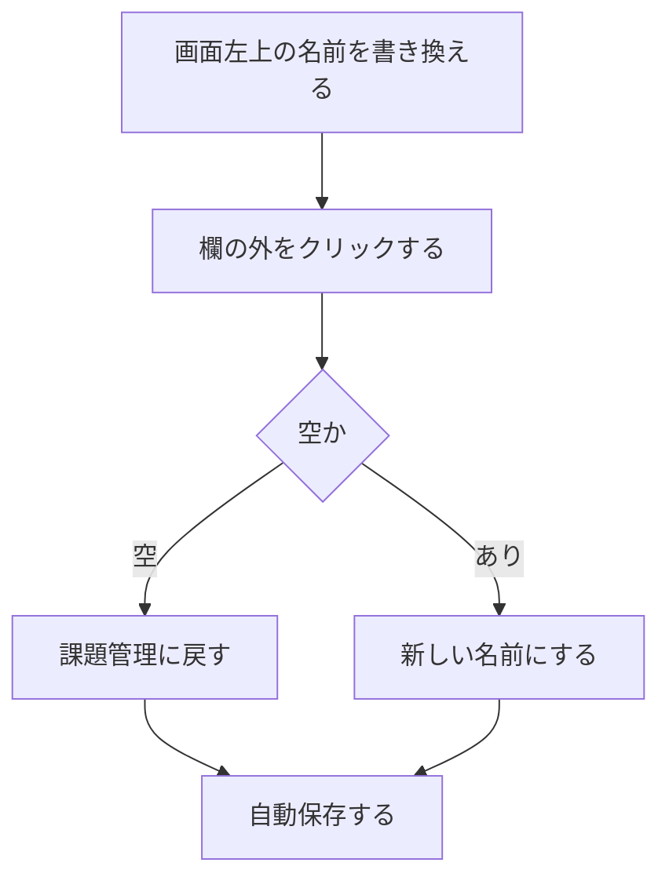
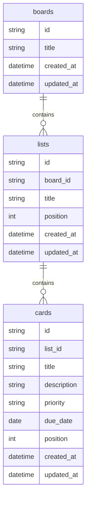
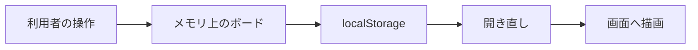

# 要件定義書

| 項目 | 内容 |
|---|---|
| 文書名 | 要件定義書 |
| 対象システム | 課題管理ボード（Trello風タスク管理アプリ） |
| 版 | 2.6 |
| 作成日 | 2026年9月18日 |
| 改訂日 | 2026年9月26日 |
| 作成者 | nsb |
| レビュー | 提出先（授業の提出をもって確認とする） |
| 承認 | なし。学習課題のため、提出が確認にあたる |
| 機密 | 学習課題の提出資料。社外秘などの扱いではない |
| 関連資料 | 用語定義書、画面設計書、画面見取り図、操作手順書 |
| 目的 | 本システムで「何を作るか」「何を作らないか」を決める |

この資料は、プログラムを書く前に決める約束事です。言葉の意味は「用語定義書」に従います。  
授業の提出・説明用であり、本番システムの運用契約（SLA）ではありません。

---

## 1. 背景と目的

学校の学習課題として、要件を決めてから画面を設計し、そのあと実装する流れを体験するために作る。

自分のやることをカードに書き、リスト（列）で進み具合を見て管理する。Trelloのように、1枚のボードの上でカードを左から右へ移し、同じ列の中でも自由に並べ替えられる使い方にする。

いま動いている画面は、フォルダ内の `index.html`、`styles.css`、`app.js` である。保存はブラウザの localStorage（キー `task-board-v1`）である。API は `backend/` の Spring Boot であり、Docker 上の PostgreSQL へ JDBC でつなぐ。`GET /api/health` で接続を確認できる。ボード・リスト・カードの API と画面の本実装はこれからである。

---

## 2. 利用者と利用の前提

| 項目 | 内容 |
|---|---|
| 利用者（操作する人） | nsb 一人。ログインはない |
| 説明先 | 提出先（教員・レビューする人）。資料の読み手であり、アプリの利用者ではない |
| 画面の数 | メインは1枚（SCR-01）。カード編集時だけ重ねて開く（SCR-02） |
| ログイン | なし |
| 他の人との共有 | なし |
| 動かす場所 | 自分のパソコンの Chrome または Edge。`index.html` を直接開く |
| ネットワーク | 不要。オフラインで使える |
| 内容の保存 | 同じパソコンの、同じブラウザに残る。別のブラウザや別のパソコンには出ない |

データはそのパソコン・そのブラウザの中にだけある。モックではサーバへは送らない。本実装では Spring Boot 経由で手元の PostgreSQL に残す。

---

## 3. 機能要件

機能要件とは、「ユーザーがこのアプリでできること」です。

### 3.1 ボード

| No. | できること | 詳細 |
|---|---|---|
| B-1 | ボードを表示する | 起動すると、ボード1枚を表示する |
| B-2 | ボード名を変更する | 画面左上の名前を書き換える。最大40文字。空にした場合は「課題管理」に戻す |

### 3.2 リスト

| No. | できること | 詳細 |
|---|---|---|
| L-1 | 初期のリストを出す | 初めて開いたときは「未着手」「作業中」「完了」の3つを出す |
| L-2 | リストを追加する | 「リストを追加」から名前を入れて作る。最大30文字 |
| L-3 | リスト名を変更する | 列の上部の名前を書き換える。最大30文字。空にすると元の名前に戻す |
| L-4 | リストを削除する | 削除の前に確認する。中のカードも一緒に消える |

### 3.3 カード

| No. | できること | 詳細 |
|---|---|---|
| C-1 | カードを追加する | タイトルを入れて追加する。優先度の初期値は「中」。説明文と期限は空 |
| C-2 | カードを編集する | カードをクリックして編集画面を開く |
| C-3 | カードを削除する | 編集画面の「削除」で消す。削除の前に確認する |
| C-4 | カードを移動する | 「左へ」「右へ」で隣のリストの一番下へ移す。端のリストでは、それ以上進めないボタンは押せないようにする。加えて、カードをつかんで同じリスト内の好きな位置へ並べ替える、または別のリストへ移す（ドラッグ） |
| C-5 | カードを並べ替える | リストごとに「優先度順」「期限順」を押すと、そのリストの中だけ並びを変える。並びは固定しない。押したときだけ効き、そのあとはドラッグで自由に並べ直せる |

### 3.4 カードの項目

| 項目 | 必須 / 任意 | 内容 |
|---|---|---|
| タイトル | 必須 | 短い名前。最大80文字。空では保存できない |
| 説明文 | 任意 | くわしいメモ。最大500文字。空でもよい |
| 優先度 | 必須 | 高 / 中 / 低。追加時の初期値は中 |
| 期限 | 任意 | 日付。空でもよい。今日より前の日付は期限切れとして分かりやすく表示する |

### 3.5 保存

| No. | できること | 詳細 |
|---|---|---|
| S-1 | 内容を残す | リストとカードの追加・変更・削除・移動・並べ替えは、自動で localStorage に残す。保存容量を超えたときの専用画面は出さない |
| S-2 | 開き直して復元する | ページを閉じても、同じブラウザで開くと前回の内容を表示する。保存がない、または JSON が壊れているときは初期ボード（未着手に説明用カード1枚）を出す |

---

## 4. ユースフローと操作フロー

- **ユースフロー**：やりたいことを達成する道筋
- **操作フロー**：画面上のクリックなどの手順

図は GitHub の Mermaid で書く。部品の詳細は画面設計書を正とする。

### 4.1 全体（課題を1件片づける）

| 項目 | 内容 |
|---|---|
| 種類 | ユースフロー |
| 対応する機能 | B-1、C-1、C-2、C-4、C-5、S-1、S-2 |

### 4.2 UF-1 起動する

| 項目 | 内容 |
|---|---|
| 種類 | 操作フロー |
| 対応する機能 | B-1、L-1、S-2 |

初期ボードは、リスト「未着手」「作業中」「完了」と、未着手の説明用カード1枚である。

### 4.3 UF-2 カードを追加する

| 項目 | 内容 |
|---|---|
| 種類 | 操作フロー |
| 対応する機能 | C-1、S-1 |

### 4.4 UF-3 カードを編集する

| 項目 | 内容 |
|---|---|
| 種類 | 操作フロー |
| 対応する機能 | C-2、C-3、S-1 |

保存・キャンセル・外側クリック・削除の4通りがある。

### 4.5 UF-4 カードを移動する

| 項目 | 内容 |
|---|---|
| 種類 | 操作フロー |
| 対応する機能 | C-4、S-1 |

「左へ」「右へ」とドラッグは画面遷移ではない。同じボード画面の中で、カードの所属リストや並び順を変える。

ドラッグは並びを固定しない。好きな順に置ける。クリックは編集画面を開く操作であり、ドラッグしたあとに誤って開かないようにする。

### 4.6 UF-4b カードを並べ替える

| 項目 | 内容 |
|---|---|
| 種類 | 操作フロー |
| 対応する機能 | C-5、S-1 |

「優先度順」「期限順」は、そのリストの中だけを、押した瞬間に並べ替える。ソート結果を維持するモードにはしない。

### 4.7 UF-5 リストを追加・改名・削除する

| 項目 | 内容 |
|---|---|
| 種類 | 操作フロー |
| 対応する機能 | L-2、L-3、L-4、S-1 |

確認のあと消した内容は元に戻らない。

### 4.8 UF-6 ボード名を変更する

| 項目 | 内容 |
|---|---|
| 種類 | 操作フロー |
| 対応する機能 | B-2、S-1 |

---

## 5. 画面要件

画面の部品・最大文字数・色の正は「画面設計書」とする。見た目を先につかむときは「画面見取り図」を見る。この節では画面の役割だけを書く。

| 画面ID | 画面名 | 役割 |
|---|---|---|
| SCR-01 | ボード画面 | 起動後に常に表示する。リストとカードを操作する |
| SCR-02 | カード編集画面 | カードをクリックしたときに重なる。確認・変更・削除をする |

- 上：ボード名と、自動保存の説明（カードはドラッグで並べ替えできることも伝える）
- 中央：リストを横に並べる
- 各リストの上部：「優先度順」「期限順」
- 各リストの中：カードを上から並べる。つかんで並べ替えできる
- カードをクリックすると、編集画面が重なって開く

画面の行き来は画面設計書の画面遷移図を正とする。「左へ」「右へ」とドラッグは画面遷移ではない。

---

## 6. データと例外

### 6.1 いまの保存と、これから使う論理モデル

いまの保存は localStorage の JSON 1件である。キーは `task-board-v1`。中身はボードの下にリスト、リストの下にカードが並んだ入れ子である。SQLite は未実装である。

下の ER は、ドメインと将来の SQLite に合わせた論理モデルである。いまのアプリが3つの表に分けて保存している、という意味ではない。

- ボード 1 に対してリストは複数
- リスト 1 に対してカードは複数
- `position` は並び順。いまの JSON では配列の順番がこれに当たる
- `created_at` と `updated_at` は論理項目。いまの JSON にはまだない

### 6.2 項目の約束

| 対象 | 項目 | 約束 |
|---|---|---|
| ボード | title | 必須。最大40文字。空なら「課題管理」 |
| リスト | title | 必須。最大30文字。空なら変更前の名前 |
| カード | title | 必須。最大80文字。空では保存できない |
| カード | description | 任意。最大500文字 |
| カード | priority | 必須。high / medium / low。画面では高 / 中 / 低。初期値は medium |
| カード | dueDate | 任意。空でもよい。今日より前なら期限切れ |

いまの JSON の期限フィールド名は `dueDate` である。論理モデルでは `due_date` と書く。

### 6.3 例外

| 状況 | 扱い |
|---|---|
| カードのタイトルが空のまま保存する | 「タイトルを入力してください。」を出し、画面は閉じない |
| ボード名を空にする | 「課題管理」に戻す |
| リスト名を空にする | 変更前の名前に戻す |
| 一番左で「左へ」、一番右で「右へ」 | ボタンは押せない |
| 「優先度順」「期限順」を押す | そのリストの中だけ並びを変える。並びは固定しない |
| カードをドラッグする | 同じリスト内の位置、または別リストへ移す。クリック扱いにはしない |
| リスト削除・カード削除を確認してはいで選ぶ | 取り消せない。中のカードもリスト削除と一緒に消える |
| 保存がない、または JSON が壊れている | 初期ボードを出す |
| 別のブラウザや別のパソコンで開く | 空（初期ボード）になる。仕様である |
| 編集画面の外側をクリックする | 保存せずに閉じる |
| localStorage の容量超過 | 今回の範囲外。専用のエラー画面は出さない |

---

## 7. データの流れ

操作はメモリ上のボードを直し、そのあと localStorage に書く。開き直すと localStorage を読んで画面を描く。

保存の関数は `saveBoard`、読み込みの関数は `loadBoard` である。サーバや SQLite はこの流れには入らない。

---

## 8. 非機能要件

数値のミリ秒は定めない。一人が1枚のボードを手元で使う前提で、保証することと今回しないことを分ける。

### 8.1 動作環境

| 今回保証する | 今回しない |
|---|---|
| Windows のパソコンで、Chrome または Edge を使う | Safari や Firefox での動作保証 |
| `index.html` を直接開いて使う | スマートフォン専用アプリ、インストール必須の配布 |

### 8.2 速さ（体感）

| 今回保証する | 今回しない |
|---|---|
| 手元の枚数なら、操作のあと画面が止まらず更新される | 応答時間のミリ秒、負荷試験、大量カードの保証 |

### 8.3 オフラインと可用性

| 今回保証する | 今回しない |
|---|---|
| ファイルを開いたあとはインターネット不要 | サーバの稼働率、24時間運用、障害窓口 |

### 8.4 データの残り方

| 今回保証する | 今回しない |
|---|---|
| 同じパソコンの同じブラウザで、キー `task-board-v1` に残る | バックアップ、別パソコンへの同期、無期限保管 |
| ブラウザの保存データを消すと消えることを説明する | 容量超過の専用画面 |

### 8.5 セキュリティ

| 今回保証する | 今回しない |
|---|---|
| ログインもサーバもない。入力した文字は画面に出すときエスケープする | 認証、通信の暗号化、他の人が同じパソコンを使ったときの保護 |

### 8.6 運用ログ

運用ログ、監視、障害対応の記録は作らない。学習課題の提出用アプリであるため。

---

## 9. 技術の選定

使う技術の正は「技術スタック」とする。要約だけここに置く。

画面は React（Vite）。サーバは Spring Boot（Java 21）。保存は手元の PostgreSQL。画面は JavaScript、API は Java。Next.js は今回の対象外である。

| 採用するもの | 理由 |
|---|---|
| React（Vite） | 画面をコンポーネントで組む。Next.js は使わない |
| Spring Boot（Java 21） | JSON の REST API を書く。ひな形は起動確認まで動く |
| PostgreSQL + JDBC | 指定の RDB。SQL が見える。Docker Compose で起動する |
| Chrome または Edge | 提出と説明で使うブラウザ |

| 採用しないもの | 理由 |
|---|---|
| Next.js | 今回の指定で対象外 |
| Node.js + Express（API） | API は Spring Boot に切り替えた |
| TypeScript / ORM / 状態ライブラリ | 今回の範囲では JDBC と React の state で足りる |
| クラウド上のデータベース | 手元の PostgreSQL で足りる |
| ドラッグ用のライブラリ | 使わない。標準のポインタ操作で、つかんで並べ替える |

---

## 10. 対象外（今回作らないもの）

次は今回の範囲に含めない。必要になったら、この資料を改訂してから追加する。  
第8章の「今回しない」と同じ方針である。ここでは機能の名前で繰り返す。

- ログイン、会員登録
- 複数人での共有、招待、権限
- 複数ボード
- 並べ替え結果を常に維持するソートモード（ボタンは押したときだけ効く）
- コメント、チェックリスト、ファイル添付
- 通知、メール
- スマートフォン専用アプリ
- 別のパソコンへの自動同期
- クラウド上のデータベース、別パソコンへの自動同期（保存は手元の PostgreSQL）
- 保存容量超過の専用画面
- 運用ログ、監視

---

## 11. 完成の定義

確認する人は利用者の nsb。環境は手元の PostgreSQL と Spring Boot、React（Vite）を起動し、Chrome または Edge で画面を開くこと。開き方の正は「操作手順書」と「技術スタック」とする。

次をすべて満たせば、最初の完成とする。

1. 画面を開くとリストが3つある
2. カードを追加・編集・削除できる
3. カードにタイトル・説明文・優先度を付けられる
4. 期限は入れることも、空にすることもできる
5. カードを左右のリストへ移せる。ドラッグでも同じ列内・別の列へ並べ替えできる
6. 「優先度順」「期限順」で、そのリストのカードを並べ替えられる。並びは固定しない
7. リストを追加・名前変更・削除できる
8. ページを開き直しても内容が消えない（本実装は手元の PostgreSQL。モックは同じブラウザの localStorage）

対象外の機能が無いことは、不合格にしない。

---

## 12. 資料の役割と改訂のルール

| 資料 | 役割 |
|---|---|
| 用語定義書 | 言葉の意味を揃える |
| 要件定義書 | 何を作るか、何を作らないかを決める。本資料 |
| 画面設計書 | 画面の部品と動きの正 |
| 画面見取り図 | 画面設計書を読む前の見た目の補助 |
| 操作手順書 | 完成したアプリの開き方と使い方 |
| Spring Boot バックエンド初期セットアップ | `backend/` のひな形の入れ方と起動確認 |

約束を変えるときは、先にこの要件定義書を直し、版を上げる。画面の部品を変えるときは画面設計書も直す。新しい言葉は用語定義書に足してから使う。

---

## 13. 改訂履歴

| 版 | 日付 | 内容 |
|---|---|---|
| 1.0 | 2026年9月18日 | 初版。事前に決めた仕様を文書化した |
| 2.0 | 2026年9月19日 | 背景・利用者・フロー図・論理ER・非機能・技術選定を追加した。保存は localStorage のままとした |
| 2.1 | 2026年9月21日 | カードのドラッグ並び替えと、優先度順・期限順のワンショット並べ替えを対象に加えた。ドラッグは対象外から外した |
| 2.2 | 2026年9月21日 | 技術選定を React（Vite）+ Express + PostgreSQL に合わせた。Next.js は対象外 |
| 2.3 | 2026年9月22日 | API を Spring Boot（Java 21）に変更。Express は採用しない |
| 2.4 | 2026年9月22日 | 資料の役割に Spring Boot バックエンド初期セットアップを追加した |
| 2.5 | 2026年9月23日 | PostgreSQL を Docker Compose で起動し、Spring Boot から接続する |
| 2.6 | 2026年9月26日 | カード追加の操作フローのボタン名を「タスク追加」にした |
